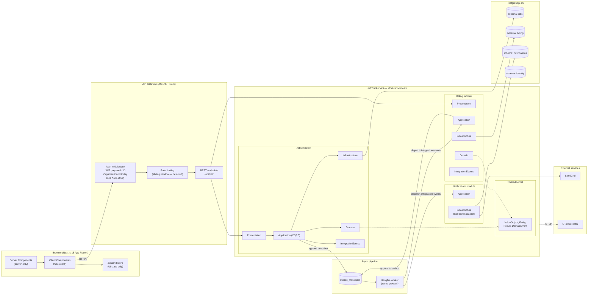
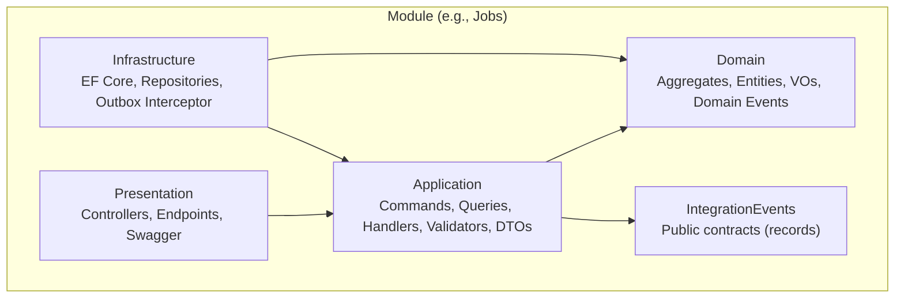
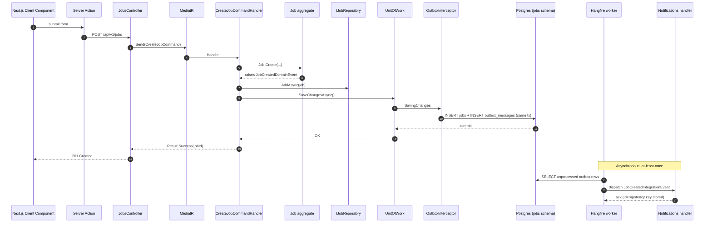
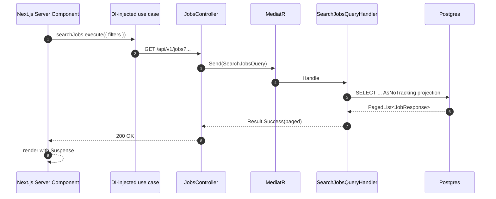
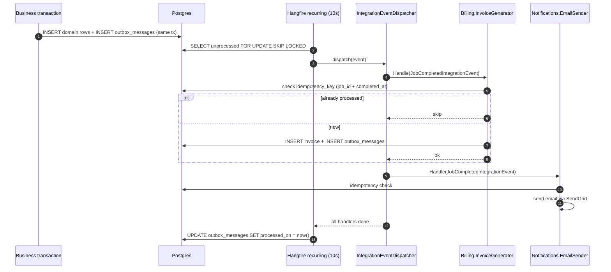

# 00 — Architecture Overview

> Project: **JobTracker** — Multi-tenant job management for a roofing company.
> Stack: **Next.js 15 (App Router) + .NET 9 + PostgreSQL 16**.
> Backend style: **Modular Monolith** (single deployable, module isolation via schemas + integration events).

---

## 0. Shipped vs. design intent

This document describes the **target architecture** for JobTracker. It intentionally covers both what is live today and what the architecture is prepared to support tomorrow — the modular boundaries, schema-per-module, integration events, and outbox pipeline exist so new modules can be added without touching the existing ones.

**Shipped in this iteration (verifiable in the repo):**

- **`Jobs` module** with three aggregates in its own bounded context: `Job`, `Customer`, `Employee`. Plus the `JobPhoto` entity as part of the `Job` aggregate.
- **Full CRUD + workflow** on Jobs (Draft → Scheduled → InProgress → Completed / Cancelled), Customers, Employees, plus photo upload and signature upload.
- **Cross-cutting**: multi-tenancy (X-Organization-Id → `ITenantContext`), Result-based error handling → RFC 7807, Serilog + OTel packages, Idempotency middleware, Outbox with Hangfire dispatcher, EF auto-migration on startup, CORS open (demo).
- **Frontend**: Next.js 15 App Router with FSD layers (`app/` + `entities/` + `features/` + `widgets/` + `shared/`), server + client fetchers, multipart signature upload.
- **DevOps**: single `docker-compose.yml` (postgres + api + web), GitHub Actions workflow templates in `Infra/github-workflows/`.

**Illustrative in this document (not shipped as code):**

- `Billing`, `Notifications`, `Identity` modules. They appear in diagrams and tables **to show how the modular monolith scales** — adding one is a matter of creating a new schema + module folder + integration event handler, without touching Jobs. The Jobs module publishes `JobCompletedIntegrationEvent` in the exact contract that a future `Billing` module would consume.
- SendGrid / OTel Collector integrations. The OTel SDK is wired in `Program.cs`; the collector wiring lives in `Infra/otel/config.yaml` for future observability.
- Login flow / JWT issuing endpoint — see [ADR-0009](./adr/0009-authentication-out-of-scope.md). JWT infrastructure is wired behind `Jwt:Enabled=false`.

The rest of this document reads as design + rationale for both cases. Every section that describes shipped functionality is annotated with a ✅ marker in section 7 ("Cross-cutting concerns → Status in this iteration").

---

## 1. Goals

| Goal | Driver |
|---|---|
| Multi-tenant SaaS ready | Each `Organization` is a tenant; strict isolation at query + schema level. |
| Clean Architecture per module | Domain independence, testability, no leakage of EF into domain. |
| DDD tactical patterns | Aggregates, Value Objects, Domain Events, Ubiquitous Language. |
| Async, reliable side-effects | Outbox pattern + Hangfire → at-least-once delivery + idempotent handlers. |
| Independent module evolution | Modules communicate **only** via integration events, never by referencing each other's DbContexts. |
| Extractable to microservices | Modules are "microservices in disguise" — each has its own schema, bounded context, and public contracts project. |

---

## 2. High-level architecture



---

## 3. Module boundaries

| Module | Owns | Publishes | Consumes |
|---|---|---|---|
| **Jobs** | Job aggregate, JobPhoto, Address VO, scheduling rules | `JobCreatedIntegrationEvent`, `JobCompletedIntegrationEvent`, `JobCancelledIntegrationEvent` | — |
| **Billing** | Invoice aggregate, InvoiceLine, pricing rules | `InvoiceGeneratedIntegrationEvent` | `JobCompletedIntegrationEvent` |
| **Notifications** | NotificationLog, delivery attempts | — | `JobCreatedIntegrationEvent`, `JobCompletedIntegrationEvent`, `InvoiceGeneratedIntegrationEvent` |
| **Identity** (stub) | User, Organization, membership | `UserCreatedIntegrationEvent` | — |

**Golden rules:**
1. A module NEVER references another module's `Domain` or `Infrastructure` project.
2. A module MAY reference another module's `IntegrationEvents` project (contracts only).
3. Cross-module communication ONLY through the outbox → Hangfire → in-proc dispatch.
4. Each module owns its own PostgreSQL **schema**; foreign keys across schemas are forbidden (use `Id` values only).

---

## 4. Clean Architecture per module



**Dependency direction (enforced by NetArchTest):**
- `Domain` depends on **nothing** (only SharedKernel primitives).
- `Application` depends on `Domain` + `IntegrationEvents`.
- `Infrastructure` depends on `Application` + `Domain`.
- `Presentation` depends on `Application`.
- `IntegrationEvents` depends on nothing (pure records).

---

## 5. Request lifecycle (write) — CreateJob



---

## 6. Request lifecycle (read) — SearchJobs



---

## 7. Cross-cutting concerns

| Concern | Approach | Status in this iteration |
|---|---|---|
| **AuthN** (see [ADR-0009](./adr/0009-authentication-out-of-scope.md)) | JWT bearer designed as the target. `sub` = userId, custom claim `org_id` = organizationId. `JwtTenantContext` already reads `org_id` from token when present, and `AddJwtBearer` is wired behind an `Jwt:Enabled` flag in `Program.cs`. | **Infrastructure prepared, login flow out of scope.** In dev the tenant travels in the `X-Organization-Id` header (still validated by `ITenantContext`). Enabling real JWT is a config flip + issuing endpoint. |
| **AuthZ** | Policy-based (`[Authorize(Policy="...")]`) once JWT is enabled. Multi-tenant scoping is always active via `ITenantContext`. | Multi-tenant scoping active. Role/permission policies deferred. |
| **Multi-tenancy** | Every row carries `organization_id`. Handlers filter through `ITenantContext.OrganizationId`. Composite indexes lead with `organization_id`. Unique constraints are tenant-scoped. | ✅ Live end-to-end (Jobs, Customers, Employees, Photos). Requests without a tenant → `MissingTenantException` → `400 problem+json`. |
| **Validation** | FluentValidation as MediatR pipeline behavior. Domain also self-validates in factories. | ✅ Live. |
| **Error handling** | `Result<T>` in application. `ExceptionToProblemDetailsMapper` middleware → RFC 7807 ProblemDetails. | ✅ Live. |
| **CORS** | Fully open policy (`AllowAnyOrigin/Header/Method`) — appropriate for dev + docker-compose; tighten with `WithOrigins(...)` for production. | ✅ Live. |
| **Logging** | Serilog structured + `TenantId`/`CorrelationId` enrichers. | ✅ Live. |
| **Tracing** | OpenTelemetry: ASP.NET, EF, HttpClient, MediatR, Hangfire → OTLP. | Wired at package level. Collector wiring deferred (bonus). |
| **Config** | `appsettings.json` + env-var overrides. `IOptions<T>` binding. | ✅ Live. |
| **Migrations** | EF Core per-module DbContext; auto-apply in Dev, CLI in prod. | ✅ Live (`InitialCreate`, `AddIdempotencyKeys`, `AddCustomers`, `AddEmployees`). |

---

## 8. Frontend architecture (headline)

- **App Router** with strict server/client split.
- **`server-only`** import in `page.tsx`; `'use client'` only on leaf components.
- **Feature Sliced Design** under `presentation/views/<page>/` with `features/<verb>/` slices.
- **Atomic Design** for shared UI.
- **Organisms are thin shells** — logic in `hooks/`.
- **Zustand** for client UI state only. Never server data.
- **Server Actions** ONLY for mutations, wrapped as thin adapters over API endpoints.

Detailed structure lives in `05-frontend-architecture.md`.

---

## 9. Async pipeline (outbox → Hangfire)



**Delivery guarantees:**
- Producer side: **atomic** with business tx → no lost events.
- Consumer side: **at-least-once** → handlers MUST be idempotent.
- Ordering: **not** globally guaranteed. Per-aggregate ordering is preserved since we process one aggregate at a time.

---

## 10. Multi-tenancy strategy

**Chosen:** *shared database, shared schema per module, discriminator column* (`organization_id`).

| Alternative | Rejected because |
|---|---|
| Schema-per-tenant | Migrations explode with N tenants; not viable for SaaS onboarding. |
| Database-per-tenant | Operational cost; connection pool exhaustion. |
| Row-level `organization_id` | Chosen. Cheap, scalable, enforced by EF global query filter + composite indexes `(organization_id, ...)`. |

**Enforcement layers:**
1. `ITenantContext` populated from JWT claim.
2. EF global query filter: `entity => entity.OrganizationId == _tenant.Id`.
3. Composite indexes lead with `organization_id`.
4. Architecture test: every aggregate root MUST expose `OrganizationId`.

---

## 11. Non-functional targets

| NFR | Target |
|---|---|
| p95 read latency (`GET /api/v1/jobs`) | < 200 ms with 100k rows/tenant |
| p95 write latency (`POST /api/v1/jobs`) | < 300 ms |
| Outbox lag (enqueued → processed) | < 15 s p95 |
| Availability | 99.5% (single-region MVP) |
| RPO / RTO | 15 min / 30 min (Postgres PITR) |

---

## 12. Technology choices (with rationale)

| Concern | Choice | Rationale |
|---|---|---|
| Web framework | ASP.NET Core 9 | DI, OpenAPI, perf. |
| ORM | EF Core 9 + Npgsql | Migrations, LINQ, owned types. |
| In-proc messaging | MediatR | CQRS + pipeline behaviors. |
| Async pipeline | Hangfire (PG-backed) | Simple, dashboard, no broker for MVP. |
| Result type | Custom `Result<T>` | Clear contracts, testable, no exceptions for flow. |
| Validation | FluentValidation | Composable, testable. |
| Domain events | MediatR `INotification` | Same tx boundary. |
| Integration events | Outbox → Hangfire → in-proc dispatcher | Reliable, at-least-once, extractable. |
| Frontend | Next.js 15 App Router | RSC, streaming, Server Actions. |
| Client state | Zustand | Minimal, selector-based, TS-friendly. |
| Client fetching | TanStack Query (when needed) | Cache, retries. |
| Styling | Tailwind + shadcn/ui | Speed, a11y baseline. |
| Testing (BE) | xUnit + FluentAssertions + Moq + NetArchTest + Testcontainers | Full pyramid. |
| Testing (FE) | Vitest + Testing Library + Playwright | Fast, DOM-friendly, POM. |
| Observability | OpenTelemetry + OTLP | Vendor-neutral. |
| Container | Docker + docker-compose | Local/prod parity. |
| CI | GitHub Actions | Lint, test, build, image push. |

---

## 13. Repository layout (target)

```
Repositories/
├── api/                                      (.NET 9 solution)
│   ├── src/
│   │   ├── Host/
│   │   │   └── JobTracker.Api/               (composition root, Program.cs)
│   │   ├── Modules/
│   │   │   └── Jobs/
│   │   │       ├── Jobs.Domain/
│   │   │       ├── Jobs.Application/
│   │   │       ├── Jobs.Infrastructure/
│   │   │       ├── Jobs.Presentation/
│   │   │       └── Jobs.IntegrationEvents/   (contract-only assembly = OHS)
│   │   └── BuildingBlocks/
│   │       ├── SharedKernel/                 (Result, Error, Entity, ValueObject, DomainEvent, IDs)
│   │       ├── Application/                  (MediatR behaviors, contracts, ITenantContext)
│   │       ├── Infrastructure/               (outbox, dispatcher, EF interceptors, file storage)
│   │       └── Presentation/                 (ApiControllerBase, ProblemDetails mapper, middlewares)
│   ├── tests/
│   │   ├── Architecture.Tests/
│   │   ├── Jobs.UnitTests/
│   │   └── Jobs.IntegrationTests/
│   ├── JobTracker.sln
│   └── Dockerfile
├── web/                                      (Next.js 15 App Router)
│   ├── app/                                  (route segments, RSC + client components)
│   ├── entities/                             (domain types + fetchers, FSD layer 1)
│   ├── features/                             (use-case slices, FSD layer 2)
│   ├── widgets/                              (composed blocks, FSD layer 3)
│   ├── shared/                               (http client, config, ui primitives)
│   ├── playwright/                           (E2E tests)
│   ├── package.json
│   └── Dockerfile
├── Documents/
│   ├── 00-architecture-overview.md
│   ├── 01..09-*.md
│   ├── diagrams/architecture.drawio          (this diagram, editable)
│   └── adr/
│       ├── 0001-modular-monolith-over-microservices.md
│       ├── ..
│       └── 0009-authentication-out-of-scope.md
├── Infra/
│   ├── otel/config.yaml                      (reserved for observability wiring)
│   └── github-workflows/                     (copy to .github/workflows/ before push)
├── docker-compose.yml                        (single source of truth: postgres + api + web)
├── README.md
├── .gitignore
└── LICENSE
```

---

## 14. Design principles applied (preview — full analysis in `09-principles.md`)

| Principle | Applied at |
|---|---|
| **S**RP | One handler per command/query. Repositories split by responsibility via partial classes. |
| **O**CP | Pipeline behaviors (validation, logging, tx) extend MediatR without changing handlers. |
| **L**SP | `IJobRepository` swappable (EF impl vs in-memory test impl). |
| **I**SP | `IJobReadRepository` vs `IJobWriteRepository` where it makes sense. |
| **D**IP | Domain defines `IJobRepository`; Infrastructure implements it. |
| Information Expert | `Job.Complete()` owns completion invariants — not the handler. |
| Creator | `Job.Create(...)` factory method creates its own children. |
| Controller | MediatR handlers act as use-case controllers. |
| Low Coupling / High Cohesion | Module boundaries + IntegrationEvents contract project. |
| Idempotency | Handler-level idempotency keys on integration event consumers. |
| Eventual Consistency | Outbox + Hangfire = business tx atomic, side effects eventually consistent. |

---

## 15. Out of scope (this iteration)

- **User authentication flow** (sign-in page, `/auth/login`, users table, password hashing, JWT issuance). Infrastructure is in place to plug it in when needed — see [ADR-0009](./adr/0009-authentication-out-of-scope.md). Tenancy is enforced via `X-Organization-Id` header (or JWT claim when enabled) — the assessment's rubric does not require a functional login flow, only that authentication appear as a cross-cutting concern in the architecture (§7 above).
- Real message broker (RabbitMQ/Kafka) — outbox works locally with Hangfire; extractable later.
- Separate read models / read DB — not needed at this scale.
- Sagas / process managers — no long-running workflows.
- Feature flags / A/B — future.
- Fine-grained RBAC — only tenant isolation + coarse policies for now.

---

## 16. Related documents

| # | Doc | Status |
|---|---|---|
| 01 | Domain model | pending |
| 02 | Database design | pending |
| 03 | Backend solution structure | pending |
| 04 | API contracts | pending |
| 05 | Frontend architecture | pending |
| 06 | Async messaging | pending |
| 07 | Testing strategy | pending |
| 08 | DevOps / CI/CD | pending |
| 09 | Principles analysis (SOLID, GRASP, GoF) | pending |
| ADR-0001 | Modular Monolith over microservices | pending |
| ADR-0002 | Outbox + Hangfire (no external broker) | pending |
| ADR-0003 | Result pattern over exceptions | pending |
| ADR-0004 | Multi-tenancy: shared DB, discriminator column | pending |
| ADR-0005 | Schema per module (Postgres) | pending |
| ADR-0006 | BigSerial PK on outbox | pending |
| ADR-0007 | Domain-to-integration event via handler | pending |
| ADR-0008 | GHCR workflow per tier | pending |
| ADR-0009 | Authentication (login flow) out of scope | pending |
