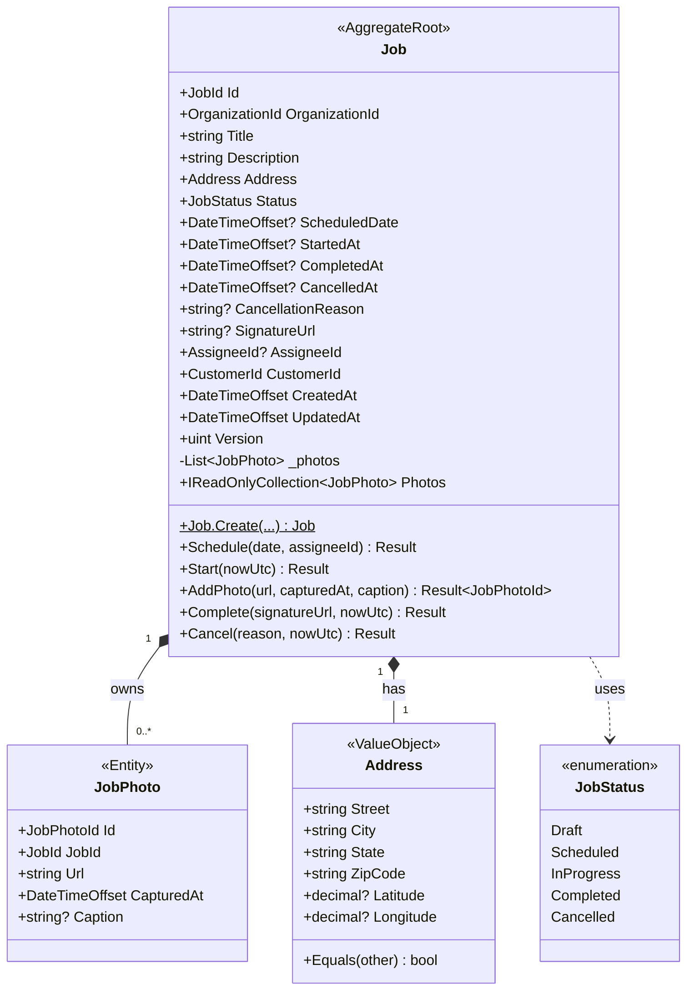
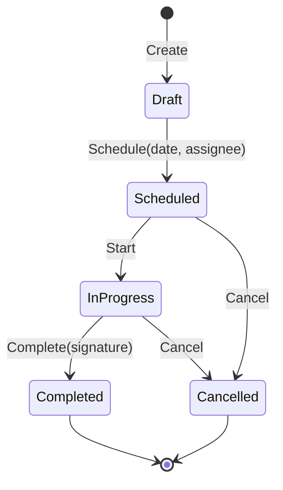

# 01 — Domain Model

> Focus: **Jobs** bounded context (deep). Billing + Notifications as conceptual stubs (public contracts only).
> Style: DDD tactical patterns — Aggregate Roots, Entities, Value Objects, Domain Events, Domain Services.
> Anti-pattern to avoid: **Anemic Domain Model**. All invariants live inside the aggregate, never in handlers.

---

## 1. Ubiquitous language (glossary)

| Term | Definition |
|---|---|
| **Organization** | Tenant. Every entity carries `OrganizationId`. Isolation boundary. |
| **Job** | A roofing work assignment. Aggregate root of the Jobs module. |
| **Assignee** | The user (crew member) responsible for executing a Job. Identified by `AssigneeId` (foreign key to Identity, not a domain entity inside Jobs). |
| **Customer** | The end-client whose property is worked on. Identified by `CustomerId`. Lives in an external bounded context (Contacts). |
| **Address** | Physical location of the Job. Value Object (structural equality). |
| **JobPhoto** | Photograph taken during job execution. Entity within the Job aggregate. Never accessed directly outside the aggregate. |
| **JobStatus** | Enum: `Draft`, `Scheduled`, `InProgress`, `Completed`, `Cancelled`. Terminal states: `Completed`, `Cancelled`. |
| **Scheduling** | The act of moving a Job from `Draft` → `Scheduled` by assigning a date and an assignee. Cannot be in the past. |
| **Completion** | The act of moving a Job from `InProgress` → `Completed`, requiring a signature URL. Triggers billing + notification. |
| **Cancellation** | Moving to `Cancelled` from `Scheduled` or `InProgress`, requiring a reason. |
| **Invoice** | Billing artifact produced asynchronously after Job completion. Lives in Billing bounded context. |
| **Domain Event** | An intra-module notification (`INotification` in MediatR). Handled within the same tx. |
| **Integration Event** | A cross-module contract (record in `*.IntegrationEvents` project). Delivered via outbox + Hangfire. |

---

## 2. Aggregate map (Jobs)



**Aggregate boundary rules:**
1. `Job` is the only entry point. `JobPhoto` is NEVER loaded or persisted independently.
2. External code holds `JobId` values, never object references to entities inside another aggregate.
3. Cross-aggregate references (Customer, Assignee) are by ID only — no navigation properties.

---

## 3. Strongly-typed IDs

Avoid `Guid` primitive obsession. Use `readonly record struct` wrappers per aggregate.

```csharp
public readonly record struct JobId(Guid Value)
{
    public static JobId New() => new(Guid.NewGuid());
    public override string ToString() => Value.ToString();
}

public readonly record struct JobPhotoId(Guid Value);
public readonly record struct OrganizationId(Guid Value);
public readonly record struct AssigneeId(Guid Value);
public readonly record struct CustomerId(Guid Value);
```

Benefits: compile-time impossibility of passing a `CustomerId` where a `JobId` is expected. EF Core value converters handle persistence.

---

## 4. Value Object — `Address`

```csharp
public sealed class Address : ValueObject
{
    public string Street { get; }
    public string City { get; }
    public string State { get; }
    public string ZipCode { get; }
    public decimal? Latitude { get; }
    public decimal? Longitude { get; }

    private Address(string street, string city, string state, string zipCode,
                    decimal? latitude, decimal? longitude)
    {
        Street = street;
        City = city;
        State = state;
        ZipCode = zipCode;
        Latitude = latitude;
        Longitude = longitude;
    }

    public static Result<Address> Create(
        string street, string city, string state, string zipCode,
        decimal? latitude = null, decimal? longitude = null)
    {
        if (string.IsNullOrWhiteSpace(street)) return Result.Failure<Address>(AddressErrors.StreetRequired);
        if (string.IsNullOrWhiteSpace(city))   return Result.Failure<Address>(AddressErrors.CityRequired);
        if (string.IsNullOrWhiteSpace(state))  return Result.Failure<Address>(AddressErrors.StateRequired);
        if (!ZipCodeRegex.IsMatch(zipCode))    return Result.Failure<Address>(AddressErrors.InvalidZipCode);
        if (latitude is < -90 or > 90)         return Result.Failure<Address>(AddressErrors.InvalidLatitude);
        if (longitude is < -180 or > 180)      return Result.Failure<Address>(AddressErrors.InvalidLongitude);

        return new Address(street.Trim(), city.Trim(), state.Trim(), zipCode.Trim(),
                           latitude, longitude);
    }

    protected override IEnumerable<object?> GetEqualityComponents()
    {
        yield return Street;
        yield return City;
        yield return State;
        yield return ZipCode;
        yield return Latitude;
        yield return Longitude;
    }

    private static readonly Regex ZipCodeRegex = new(@"^\d{5}(-\d{4})?$", RegexOptions.Compiled);
}
```

**Design notes:**
- Immutable, private constructor, factory `Create` returns `Result<Address>`.
- Structural equality via `GetEqualityComponents()` in `ValueObject` base.
- Latitude/Longitude optional; validated only when present.
- Persisted as **owned type** in EF Core (columns in the `jobs` table, no separate table).

---

## 5. Entity — `JobPhoto`

```csharp
public sealed class JobPhoto : Entity<JobPhotoId>
{
    public JobId JobId { get; private set; }
    public string Url { get; private set; }
    public DateTimeOffset CapturedAt { get; private set; }
    public string? Caption { get; private set; }

    private JobPhoto() { /* EF Core */ }

    internal JobPhoto(JobPhotoId id, JobId jobId, string url, DateTimeOffset capturedAt, string? caption)
        : base(id)
    {
        JobId = jobId;
        Url = url;
        CapturedAt = capturedAt;
        Caption = caption;
    }
}
```

**Accessibility:** the constructor is `internal` and only `Job.AddPhoto(...)` can instantiate it. Outside the module you cannot create a `JobPhoto` — you must go through the aggregate root.

---

## 6. Aggregate Root — `Job`

### 6.1 Skeleton

```csharp
public sealed class Job : AggregateRoot<JobId>
{
    private readonly List<JobPhoto> _photos = new();

    public OrganizationId OrganizationId { get; private set; }
    public string Title { get; private set; } = null!;
    public string Description { get; private set; } = null!;
    public Address Address { get; private set; } = null!;
    public JobStatus Status { get; private set; }
    public DateTimeOffset? ScheduledDate { get; private set; }
    public DateTimeOffset? StartedAt { get; private set; }
    public DateTimeOffset? CompletedAt { get; private set; }
    public DateTimeOffset? CancelledAt { get; private set; }
    public string? CancellationReason { get; private set; }
    public string? SignatureUrl { get; private set; }
    public AssigneeId? AssigneeId { get; private set; }
    public CustomerId CustomerId { get; private set; }
    public DateTimeOffset CreatedAt { get; private set; }
    public DateTimeOffset UpdatedAt { get; private set; }
    public uint Version { get; private set; }                 // optimistic concurrency (xmin)
    public IReadOnlyCollection<JobPhoto> Photos => _photos.AsReadOnly();

    private Job() { /* EF Core */ }

    public static Result<Job> Create(
        OrganizationId organizationId,
        string title,
        string description,
        Address address,
        CustomerId customerId,
        DateTimeOffset nowUtc)
    {
        if (string.IsNullOrWhiteSpace(title) || title.Length > 200)
            return Result.Failure<Job>(JobErrors.InvalidTitle);
        if (description?.Length > 4000)
            return Result.Failure<Job>(JobErrors.DescriptionTooLong);

        var job = new Job
        {
            Id = JobId.New(),
            OrganizationId = organizationId,
            Title = title.Trim(),
            Description = (description ?? string.Empty).Trim(),
            Address = address,
            Status = JobStatus.Draft,
            CustomerId = customerId,
            CreatedAt = nowUtc,
            UpdatedAt = nowUtc
        };

        job.RaiseDomainEvent(new JobCreatedDomainEvent(
            job.Id, job.OrganizationId, job.CustomerId, nowUtc));

        return job;
    }
}
```

### 6.2 State machine (invariants)



**Invariants (enforced inside `Job` methods):**

| Rule | Enforced in |
|---|---|
| A Job cannot be scheduled in the past | `Schedule(...)` |
| A Job in `Completed` or `Cancelled` cannot transition | every state-changing method |
| Only `Scheduled` jobs can move to `InProgress` | `Start(...)` |
| Only `InProgress` jobs can move to `Completed` | `Complete(...)` |
| Completion requires a non-empty signature URL | `Complete(...)` |
| Cancellation requires a non-empty reason | `Cancel(...)` |
| `Schedule` requires an `AssigneeId` | `Schedule(...)` |
| Cannot add photos to a terminal Job | `AddPhoto(...)` |
| `OrganizationId` is immutable after creation | private setter, never called elsewhere |

### 6.3 Behavior methods

```csharp
public Result Schedule(DateTimeOffset scheduledDate, AssigneeId assigneeId, DateTimeOffset nowUtc)
{
    if (Status is not JobStatus.Draft)
        return Result.Failure(JobErrors.InvalidTransition(Status, JobStatus.Scheduled));
    if (scheduledDate <= nowUtc)
        return Result.Failure(JobErrors.CannotScheduleInPast);

    Status = JobStatus.Scheduled;
    ScheduledDate = scheduledDate;
    AssigneeId = assigneeId;
    UpdatedAt = nowUtc;

    RaiseDomainEvent(new JobScheduledDomainEvent(Id, OrganizationId, assigneeId, scheduledDate));
    return Result.Success();
}

public Result Start(DateTimeOffset nowUtc)
{
    if (Status is not JobStatus.Scheduled)
        return Result.Failure(JobErrors.InvalidTransition(Status, JobStatus.InProgress));

    Status = JobStatus.InProgress;
    StartedAt = nowUtc;
    UpdatedAt = nowUtc;
    return Result.Success();
}

public Result<JobPhotoId> AddPhoto(string url, DateTimeOffset capturedAt, string? caption)
{
    if (Status is JobStatus.Completed or JobStatus.Cancelled)
        return Result.Failure<JobPhotoId>(JobErrors.CannotAddPhotoToTerminalJob);
    if (string.IsNullOrWhiteSpace(url) || !Uri.IsWellFormedUriString(url, UriKind.Absolute))
        return Result.Failure<JobPhotoId>(JobErrors.InvalidPhotoUrl);
    if (caption?.Length > 500)
        return Result.Failure<JobPhotoId>(JobErrors.CaptionTooLong);

    var photoId = new JobPhotoId(Guid.NewGuid());
    _photos.Add(new JobPhoto(photoId, Id, url, capturedAt, caption));
    UpdatedAt = capturedAt;
    return photoId;
}

public Result Complete(string signatureUrl, DateTimeOffset nowUtc)
{
    if (Status is not JobStatus.InProgress)
        return Result.Failure(JobErrors.InvalidTransition(Status, JobStatus.Completed));
    if (string.IsNullOrWhiteSpace(signatureUrl))
        return Result.Failure(JobErrors.SignatureRequired);
    if (!Uri.IsWellFormedUriString(signatureUrl, UriKind.Absolute))
        return Result.Failure(JobErrors.InvalidSignatureUrl);

    Status = JobStatus.Completed;
    SignatureUrl = signatureUrl;
    CompletedAt = nowUtc;
    UpdatedAt = nowUtc;

    RaiseDomainEvent(new JobCompletedDomainEvent(
        Id, OrganizationId, CustomerId, AssigneeId!.Value,
        StartedAt!.Value, nowUtc, signatureUrl));
    return Result.Success();
}

public Result Cancel(string reason, DateTimeOffset nowUtc)
{
    if (Status is JobStatus.Completed or JobStatus.Cancelled)
        return Result.Failure(JobErrors.InvalidTransition(Status, JobStatus.Cancelled));
    if (string.IsNullOrWhiteSpace(reason) || reason.Length > 500)
        return Result.Failure(JobErrors.InvalidCancellationReason);

    Status = JobStatus.Cancelled;
    CancellationReason = reason.Trim();
    CancelledAt = nowUtc;
    UpdatedAt = nowUtc;

    RaiseDomainEvent(new JobCancelledDomainEvent(Id, OrganizationId, reason, nowUtc));
    return Result.Success();
}
```

**Design highlights:**
- **Never a public setter** on a state-driven property. Only behavior methods mutate state.
- **No `DateTime.UtcNow`** inside the aggregate — time is injected as a parameter. Enables deterministic testing and matches the "no I/O in domain" rule.
- **Domain events raised on state transitions**, not on every setter.
- **`Result<T>`** for expected failure paths (validation, invalid transition). Exceptions are reserved for truly exceptional / bug scenarios.
- **Optimistic concurrency** via `Version` mapped to Postgres `xmin` (see 02-database-design.md).

---

## 7. Domain errors (typed)

```csharp
public static class JobErrors
{
    public static readonly Error InvalidTitle =
        Error.Validation("Job.InvalidTitle", "Job title must be 1–200 chars.");
    public static readonly Error DescriptionTooLong =
        Error.Validation("Job.DescriptionTooLong", "Description must be ≤ 4000 chars.");
    public static readonly Error CannotScheduleInPast =
        Error.Conflict("Job.CannotScheduleInPast", "Scheduled date must be in the future.");
    public static Error InvalidTransition(JobStatus from, JobStatus to) =>
        Error.Conflict("Job.InvalidTransition", $"Cannot transition from {from} to {to}.");
    public static readonly Error SignatureRequired =
        Error.Validation("Job.SignatureRequired", "Signature is required to complete a job.");
    public static readonly Error InvalidSignatureUrl =
        Error.Validation("Job.InvalidSignatureUrl", "Signature URL must be absolute.");
    public static readonly Error InvalidCancellationReason =
        Error.Validation("Job.InvalidCancellationReason", "Cancellation reason must be 1–500 chars.");
    public static readonly Error InvalidPhotoUrl =
        Error.Validation("Job.InvalidPhotoUrl", "Photo URL must be absolute.");
    public static readonly Error CaptionTooLong =
        Error.Validation("Job.CaptionTooLong", "Caption must be ≤ 500 chars.");
    public static readonly Error CannotAddPhotoToTerminalJob =
        Error.Conflict("Job.CannotAddPhotoToTerminalJob", "Cannot add photos to a completed/cancelled job.");
    public static Error NotFound(JobId id) =>
        Error.NotFound("Job.NotFound", $"Job {id} not found.");
}
```

`Error` carries a stable **code** (machine-readable), a **message** (human-readable), and a **type** (Validation / Conflict / NotFound / Unauthorized / Unexpected). Mapped by the exception middleware to RFC 7807 ProblemDetails and to HTTP status codes.

---

## 8. Domain events

Domain events are intra-module `INotification`. They are:
- **Raised** by aggregates via `RaiseDomainEvent(...)`.
- **Collected** by the `OutboxInterceptor` before `SaveChanges`.
- **Persisted** as `outbox_messages` rows in the same transaction.
- **Dispatched** to in-proc `INotificationHandler<T>` by Hangfire, and **translated** to integration events when they cross a module boundary.

```csharp
public interface IDomainEvent : INotification
{
    Guid Id { get; }
    DateTimeOffset OccurredOn { get; }
}

public sealed record JobCreatedDomainEvent(
    JobId JobId,
    OrganizationId OrganizationId,
    CustomerId CustomerId,
    DateTimeOffset OccurredOn) : IDomainEvent
{
    public Guid Id { get; } = Guid.NewGuid();
}

public sealed record JobScheduledDomainEvent(
    JobId JobId,
    OrganizationId OrganizationId,
    AssigneeId AssigneeId,
    DateTimeOffset ScheduledDate,
    DateTimeOffset OccurredOn) : IDomainEvent
{
    public Guid Id { get; } = Guid.NewGuid();
}

public sealed record JobCompletedDomainEvent(
    JobId JobId,
    OrganizationId OrganizationId,
    CustomerId CustomerId,
    AssigneeId AssigneeId,
    DateTimeOffset StartedAt,
    DateTimeOffset CompletedAt,
    string SignatureUrl,
    DateTimeOffset OccurredOn) : IDomainEvent
{
    public Guid Id { get; } = Guid.NewGuid();
}

public sealed record JobCancelledDomainEvent(
    JobId JobId,
    OrganizationId OrganizationId,
    string Reason,
    DateTimeOffset OccurredOn) : IDomainEvent
{
    public Guid Id { get; } = Guid.NewGuid();
}
```

**Domain event vs Integration event:**

| Aspect | Domain event | Integration event |
|---|---|---|
| Scope | Inside a module (same bounded context) | Across modules |
| Type location | `Jobs.Domain` | `Jobs.IntegrationEvents` |
| Transaction | Same tx as the business operation | Business tx commits, event is dispatched later |
| Handler location | `Jobs.Application` | Any module that subscribes |
| Serialization | Not serialized (in-proc types) | JSON persisted in outbox |
| Coupling | Tightly coupled to internal types | Loose — external contract, versioned |

Example translation (in `Jobs.Application`):

```csharp
internal sealed class JobCompletedIntegrationEventPublisher
    : INotificationHandler<JobCompletedDomainEvent>
{
    private readonly IOutboxWriter _outbox;

    public Task Handle(JobCompletedDomainEvent e, CancellationToken ct)
        => _outbox.EnqueueAsync(new JobCompletedIntegrationEvent(
            e.JobId.Value, e.OrganizationId.Value, e.CustomerId.Value,
            e.AssigneeId.Value, e.StartedAt, e.CompletedAt, e.SignatureUrl,
            e.OccurredOn), ct);
}
```

---

## 9. Domain services

The Jobs bounded context does **not** currently need domain services — all invariants live in `Job`. If cross-aggregate logic emerges (e.g., "cannot schedule two jobs for the same assignee at overlapping times"), a `SchedulingConflictChecker` domain service will be introduced in `Jobs.Domain`.

**Guideline:** introduce a domain service only when the behavior does not naturally belong to a single aggregate and does not require I/O.

---

## 10. Repository contract (domain-owned)

```csharp
public interface IJobRepository
{
    Task<Job?> GetByIdAsync(JobId id, CancellationToken ct);
    Task AddAsync(Job job, CancellationToken ct);
    Task<PagedList<Job>> SearchAsync(JobSearchCriteria criteria, CancellationToken ct);
}
```

- Lives in `Jobs.Domain`. Implementation lives in `Jobs.Infrastructure`.
- `Job` is always loaded with its `_photos` collection (aggregate consistency).
- No `Update(...)` method — EF Core tracks changes; `SaveChangesAsync` persists.
- No `DeleteAsync` — deletion is not a business operation; jobs are cancelled, not deleted.

Partial-class split (in Infrastructure):
- `JobRepository.Writes.cs` — `GetByIdAsync`, `AddAsync`.
- `JobRepository.Reads.cs` — `SearchAsync` (projected, read-optimized).

A separate read-optimized interface will live in `Jobs.Application` (`IJobReadRepository`) for query handlers, projecting straight to DTOs. See 02 and 03.

---

## 11. Billing bounded context (stub)

Contract-only for this iteration; full model in a later increment.

- **Aggregate root:** `Invoice(Id, OrganizationId, JobId, CustomerId, Amount, Status)`.
- **Public contracts:**
  - `InvoiceGeneratedIntegrationEvent(InvoiceId, JobId, OrganizationId, Amount, GeneratedAt)`.
- **Subscribes to:** `Jobs.IntegrationEvents.JobCompletedIntegrationEvent`.
- **Idempotency key** for the subscriber: `(JobId, CompletedAt)` — see 06-async-messaging.md.
- **Domain rules (headline):**
  - An invoice is generated at most once per completed Job (idempotency).
  - `Amount` is derived by a pricing service (stubbed as fixed rate × photo count for MVP).

---

## 12. Notifications bounded context (stub)

- **Aggregate root:** `NotificationLog(Id, OrganizationId, RecipientId, Channel, Template, Status, Attempts)`.
- **Public contracts:** none (write-only consumer for this iteration).
- **Subscribes to:**
  - `Jobs.IntegrationEvents.JobCreatedIntegrationEvent` → notify assignee.
  - `Jobs.IntegrationEvents.JobCompletedIntegrationEvent` → notify customer.
  - `Billing.IntegrationEvents.InvoiceGeneratedIntegrationEvent` → notify customer with invoice link.
- **Adapter:** `ISendGridClient` (thin wrapper over SendGrid SDK) in Infrastructure.
- **Idempotency key:** `(EventId)` — since each integration event carries its own stable ID from the outbox.

---

## 13. Consistency model

| Boundary | Consistency |
|---|---|
| Within an aggregate (`Job` + `JobPhoto`) | **Strong** — enforced by the aggregate root inside a transaction. |
| Between aggregates in the same module | **Strong** by convention (same tx) but the design discourages this to keep aggregates small. |
| Across modules (Jobs → Billing / Notifications) | **Eventual** — via outbox + Hangfire. Handlers must be idempotent. |
| Across tenants | **Isolated** — a tenant NEVER sees another tenant's data. |

---

## 14. Design principles applied in this document

| Principle | Where |
|---|---|
| **Encapsulation** | Aggregate exposes methods, not setters. `_photos` is `private`. |
| **Information Expert** | `Job.Complete()` owns completion invariants — the closest thing to the data owns the behavior. |
| **Creator** | `Job.Create(...)` is a static factory; `Job.AddPhoto(...)` creates its own children (`JobPhoto` constructor is `internal`). |
| **Tell, Don't Ask** | Handlers call `job.Complete(sig, now)` instead of reading state and computing outside. |
| **Immutability where possible** | `Address` and all domain event records are immutable. |
| **Fail fast** | Invariant violations return `Result.Failure` immediately; no partial state. |
| **Primitive obsession avoided** | Strongly-typed IDs (`JobId`, `OrganizationId`). |
| **No I/O in domain** | Time and randomness are injected as parameters. |
| **Explicit vocabulary** | Ubiquitous language section aligns code, docs, and stakeholders. |

---

## 15. Open questions / follow-ups

| Q | Owner | Notes |
|---|---|---|
| Should `AssigneeId` become a Value Object with a name cache (denormalization)? | Product | Trade-off in 02-database-design §Denormalization. |
| Do we need `Job.Rescheduled` as a distinct event (vs `Scheduled` again)? | Product | Currently we only fire `JobScheduledDomainEvent`; rescheduling would be a separate method. |
| Should photo uploads be soft-deletable? | Product | For this iteration: no delete, no soft-delete. |
| Concurrency conflict UX | UX | Optimistic concurrency; 409 to client with fresh `Version`. |

---

## 16. Next document

`02-database-design.md` — the Postgres schema, indexes, EF Core configuration, migration plan, and the optimized cursor-paginated FTS query.
