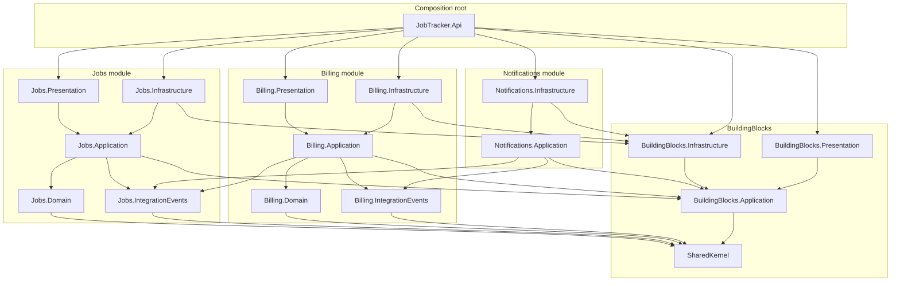
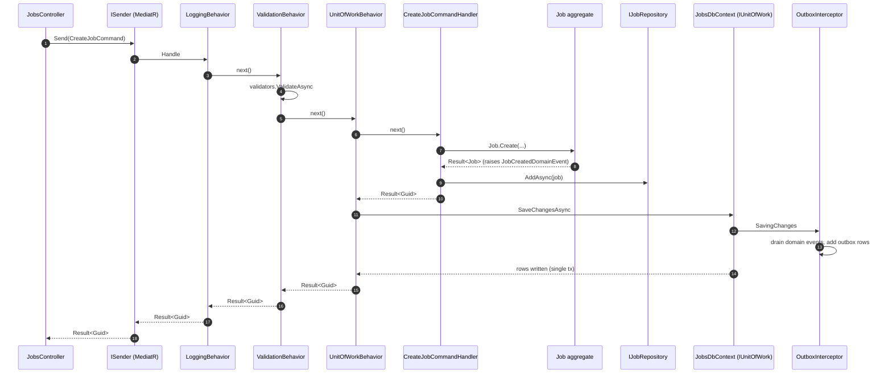

# 03 — Backend Solution Structure (.NET 9)

> Scope: How the C# projects are organized, how they reference each other, DI wiring per module, CQRS + MediatR pipeline, Result/Error contract, and how each Clean Architecture rule is enforced (with NetArchTest tests).
> Style: **Modular Monolith with Clean Architecture per module**.

---

## 1. Solution layout

```
api/
├── JobTracker.sln
├── Directory.Build.props                         # global compiler flags + Nuget locking
├── Directory.Packages.props                      # centrally-managed package versions
├── nuget.config
├── docker-compose.yml                            # postgres + api + otel-collector
├── src/
│   ├── Api/
│   │   └── JobTracker.Api.csproj                 # composition root (webapi)
│   │
│   ├── BuildingBlocks/
│   │   ├── SharedKernel/
│   │   │   └── JobTracker.SharedKernel.csproj    # AggregateRoot, Entity, ValueObject, Result, Error
│   │   ├── Application/
│   │   │   └── JobTracker.BuildingBlocks.Application.csproj
│   │   │                                          # MediatR pipeline behaviors, IUnitOfWork,
│   │   │                                          # ICurrentUserContext, ITenantContext, IDateTimeProvider,
│   │   │                                          # IOutboxWriter, PagedList, Cursor, JsonSerializerFactory
│   │   ├── Infrastructure/
│   │   │   └── JobTracker.BuildingBlocks.Infrastructure.csproj
│   │   │                                          # BaseDbContext helpers, OutboxInterceptor,
│   │   │                                          # DateTimeProvider, TenantAccessor,
│   │   │                                          # ExceptionToProblemDetailsMapper,
│   │   │                                          # HangfireOutboxProcessorBase
│   │   └── Presentation/
│   │       └── JobTracker.BuildingBlocks.Presentation.csproj
│   │                                              # ProblemDetailsFactory, ResultExtensions,
│   │                                              # ApiVersioning, base Controller
│   │
│   └── Modules/
│       ├── Jobs/
│       │   ├── Jobs.Domain/
│       │   │   └── Jobs.Domain.csproj             # aggregates, VOs, events, IJobRepository
│       │   ├── Jobs.Application/
│       │   │   └── Jobs.Application.csproj        # CQRS handlers, validators, DTOs, IJobReadRepository
│       │   ├── Jobs.Infrastructure/
│       │   │   └── Jobs.Infrastructure.csproj     # JobsDbContext, JobRepository, migrations
│       │   ├── Jobs.Presentation/
│       │   │   └── Jobs.Presentation.csproj       # JobsController(s), Swagger tags
│       │   └── Jobs.IntegrationEvents/
│       │       └── Jobs.IntegrationEvents.csproj  # public event records (pure POCO)
│       │
│       ├── Billing/
│       │   ├── Billing.Domain/
│       │   ├── Billing.Application/
│       │   ├── Billing.Infrastructure/
│       │   ├── Billing.Presentation/
│       │   └── Billing.IntegrationEvents/
│       │
│       └── Notifications/
│           ├── Notifications.Application/         # only Application + Infra needed for MVP
│           ├── Notifications.Infrastructure/
│           └── Notifications.IntegrationEvents/   # empty for MVP (consumer only)
│
└── tests/
    ├── Architecture.Tests/
    │   └── JobTracker.Architecture.Tests.csproj   # NetArchTest rules
    ├── Jobs.Domain.UnitTests/
    ├── Jobs.Application.UnitTests/
    ├── Jobs.Infrastructure.IntegrationTests/      # Testcontainers Postgres
    ├── Billing.Domain.UnitTests/
    └── Api.EndToEndTests/                          # WebApplicationFactory + Testcontainers
```

**Naming convention:** every project ends in `<Module>.<Layer>.csproj`. Assembly name matches project name.

---

## 2. Project references (dependency graph)



**Rules encoded in the graph (verified by architecture tests, §9):**
1. `*.Domain` references **only** `SharedKernel`.
2. `*.Application` references its own `Domain`, its own `IntegrationEvents`, other modules' `IntegrationEvents`, and `BuildingBlocks.Application`.
3. `*.Infrastructure` references its own `Application` + `Domain` + `BuildingBlocks.Infrastructure`. Never another module's Application or Infrastructure.
4. `*.Presentation` references its own `Application` + `BuildingBlocks.Presentation`.
5. `*.IntegrationEvents` references **only** `SharedKernel` (for shared value types like `EventId`).
6. `Api` (composition root) is the **only** project that references everything.

---

## 3. Centrally-managed packages

`Directory.Packages.props` (headline):

```xml
<Project>
  <PropertyGroup>
    <ManagePackageVersionsCentrally>true</ManagePackageVersionsCentrally>
    <CentralPackageTransitivePinningEnabled>true</CentralPackageTransitivePinningEnabled>
  </PropertyGroup>
  <ItemGroup>
    <PackageVersion Include="MediatR" Version="12.*" />
    <PackageVersion Include="FluentValidation" Version="11.*" />
    <PackageVersion Include="FluentValidation.DependencyInjectionExtensions" Version="11.*" />
    <PackageVersion Include="Microsoft.EntityFrameworkCore" Version="9.*" />
    <PackageVersion Include="Microsoft.EntityFrameworkCore.Design" Version="9.*" />
    <PackageVersion Include="Npgsql.EntityFrameworkCore.PostgreSQL" Version="9.*" />
    <PackageVersion Include="EFCore.NamingConventions" Version="9.*" />
    <PackageVersion Include="Hangfire.AspNetCore" Version="1.8.*" />
    <PackageVersion Include="Hangfire.PostgreSql" Version="1.20.*" />
    <PackageVersion Include="Serilog.AspNetCore" Version="8.*" />
    <PackageVersion Include="Serilog.Sinks.Console" Version="6.*" />
    <PackageVersion Include="Serilog.Enrichers.CorrelationId" Version="3.*" />
    <PackageVersion Include="OpenTelemetry.Extensions.Hosting" Version="1.*" />
    <PackageVersion Include="OpenTelemetry.Instrumentation.AspNetCore" Version="1.*" />
    <PackageVersion Include="OpenTelemetry.Instrumentation.EntityFrameworkCore" Version="1.*-beta" />
    <PackageVersion Include="OpenTelemetry.Instrumentation.Http" Version="1.*" />
    <PackageVersion Include="OpenTelemetry.Exporter.OpenTelemetryProtocol" Version="1.*" />
    <PackageVersion Include="Microsoft.AspNetCore.Authentication.JwtBearer" Version="9.*" />
    <PackageVersion Include="Asp.Versioning.Http" Version="8.*" />
    <PackageVersion Include="Asp.Versioning.Mvc.ApiExplorer" Version="8.*" />
    <PackageVersion Include="Swashbuckle.AspNetCore" Version="7.*" />

    <!-- test -->
    <PackageVersion Include="xunit" Version="2.9.*" />
    <PackageVersion Include="xunit.runner.visualstudio" Version="3.*" />
    <PackageVersion Include="FluentAssertions" Version="7.*" />
    <PackageVersion Include="Moq" Version="4.*" />
    <PackageVersion Include="NetArchTest.Rules" Version="1.*" />
    <PackageVersion Include="Testcontainers.PostgreSql" Version="4.*" />
    <PackageVersion Include="Microsoft.AspNetCore.Mvc.Testing" Version="9.*" />
    <PackageVersion Include="coverlet.collector" Version="6.*" />
  </ItemGroup>
</Project>
```

`Directory.Build.props`:

```xml
<Project>
  <PropertyGroup>
    <TargetFramework>net9.0</TargetFramework>
    <Nullable>enable</Nullable>
    <ImplicitUsings>enable</ImplicitUsings>
    <TreatWarningsAsErrors>true</TreatWarningsAsErrors>
    <WarningsAsErrors>nullable</WarningsAsErrors>
    <LangVersion>latest</LangVersion>
    <IsPackable>false</IsPackable>
    <EnforceCodeStyleInBuild>true</EnforceCodeStyleInBuild>
  </PropertyGroup>
</Project>
```

---

## 4. SharedKernel

Contains **only** stable primitives shared by all domains. No framework references.

```csharp
// AggregateRoot.cs
public abstract class AggregateRoot<TId> : Entity<TId> where TId : struct
{
    private readonly List<IDomainEvent> _events = new();
    public IReadOnlyCollection<IDomainEvent> Events => _events.AsReadOnly();
    protected void RaiseDomainEvent(IDomainEvent e) => _events.Add(e);
    public IReadOnlyCollection<IDomainEvent> DrainEvents()
    {
        var copy = _events.ToArray();
        _events.Clear();
        return copy;
    }
}

// Entity.cs
public abstract class Entity<TId> where TId : struct
{
    public TId Id { get; protected set; }
    protected Entity() { }
    protected Entity(TId id) => Id = id;
    public override bool Equals(object? obj) =>
        obj is Entity<TId> other && EqualityComparer<TId>.Default.Equals(Id, other.Id);
    public override int GetHashCode() => Id.GetHashCode();
}

// ValueObject.cs
public abstract class ValueObject
{
    protected abstract IEnumerable<object?> GetEqualityComponents();
    public override bool Equals(object? obj) =>
        obj is ValueObject vo && GetEqualityComponents().SequenceEqual(vo.GetEqualityComponents());
    public override int GetHashCode() =>
        GetEqualityComponents().Aggregate(1, (h, o) => HashCode.Combine(h, o));
    public static bool operator ==(ValueObject? a, ValueObject? b) => Equals(a, b);
    public static bool operator !=(ValueObject? a, ValueObject? b) => !Equals(a, b);
}

// Result.cs
public readonly record struct Result
{
    public bool IsSuccess { get; }
    public Error Error { get; }
    private Result(bool ok, Error e) { IsSuccess = ok; Error = e; }
    public static Result Success() => new(true, Error.None);
    public static Result Failure(Error e) => new(false, e);
    public static Result<T> Success<T>(T value) => Result<T>.Success(value);
    public static Result<T> Failure<T>(Error e) => Result<T>.Failure(e);
}

public readonly record struct Result<T>
{
    public bool IsSuccess { get; }
    public T? Value { get; }
    public Error Error { get; }
    private Result(bool ok, T? v, Error e) { IsSuccess = ok; Value = v; Error = e; }
    public static Result<T> Success(T value) => new(true, value, Error.None);
    public static Result<T> Failure(Error e) => new(false, default, e);
    public static implicit operator Result<T>(T value) => Success(value);
    public static implicit operator Result<T>(Error e) => Failure(e);
}

// Error.cs
public readonly record struct Error(string Code, string Message, ErrorType Type)
{
    public static readonly Error None = new(string.Empty, string.Empty, ErrorType.None);
    public static Error Validation(string code, string msg) => new(code, msg, ErrorType.Validation);
    public static Error Conflict(string code, string msg)   => new(code, msg, ErrorType.Conflict);
    public static Error NotFound(string code, string msg)   => new(code, msg, ErrorType.NotFound);
    public static Error Unauthorized(string code, string msg) => new(code, msg, ErrorType.Unauthorized);
    public static Error Unexpected(string code, string msg) => new(code, msg, ErrorType.Unexpected);
}

public enum ErrorType { None, Validation, NotFound, Conflict, Unauthorized, Unexpected }

// IDomainEvent.cs
public interface IDomainEvent : MediatR.INotification
{
    Guid Id { get; }
    DateTimeOffset OccurredOn { get; }
}
```

Rationale: `SharedKernel` deliberately depends on `MediatR` only for the `INotification` marker so aggregates can raise events without coupling every module to MediatR wiring code. If we wanted zero MediatR dependency, we'd define our own `INotification` marker; deferred as a stylistic choice.

---

## 5. BuildingBlocks.Application

Cross-cutting application concerns.

### 5.1 Pipeline behaviors

```csharp
public sealed class ValidationBehavior<TRequest, TResponse>(IEnumerable<IValidator<TRequest>> validators)
    : IPipelineBehavior<TRequest, TResponse>
    where TRequest : IRequest<TResponse>
    where TResponse : struct
{
    public async Task<TResponse> Handle(TRequest req, RequestHandlerDelegate<TResponse> next, CancellationToken ct)
    {
        if (!validators.Any()) return await next();
        var ctx = new ValidationContext<TRequest>(req);
        var failures = (await Task.WhenAll(validators.Select(v => v.ValidateAsync(ctx, ct))))
            .SelectMany(r => r.Errors).Where(f => f is not null).ToList();

        if (failures.Count == 0) return await next();

        // TResponse is constrained to be a Result / Result<T> record struct;
        // We reflect the single factory method Failure(Error) to build a typed failure.
        return ResultFactory.CreateValidationFailure<TResponse>(failures);
    }
}

public sealed class LoggingBehavior<TRequest, TResponse>(ILogger<LoggingBehavior<TRequest, TResponse>> log)
    : IPipelineBehavior<TRequest, TResponse>
    where TRequest : IRequest<TResponse>
{
    public async Task<TResponse> Handle(TRequest req, RequestHandlerDelegate<TResponse> next, CancellationToken ct)
    {
        var name = typeof(TRequest).Name;
        log.LogInformation("Handling {Request}", name);
        var sw = Stopwatch.StartNew();
        try
        {
            var response = await next();
            log.LogInformation("Handled {Request} in {Elapsed}ms", name, sw.ElapsedMilliseconds);
            return response;
        }
        catch (Exception ex)
        {
            log.LogError(ex, "Unhandled exception in {Request}", name);
            throw;
        }
    }
}

public sealed class UnitOfWorkBehavior<TRequest, TResponse>(IUnitOfWork uow)
    : IPipelineBehavior<TRequest, TResponse>
    where TRequest : ICommand<TResponse>       // marker: only commands get a UoW
{
    public async Task<TResponse> Handle(TRequest req, RequestHandlerDelegate<TResponse> next, CancellationToken ct)
    {
        var response = await next();
        await uow.SaveChangesAsync(ct);
        return response;
    }
}
```

**Marker interfaces:**
```csharp
public interface ICommand<TResponse> : IRequest<TResponse> { }
public interface IQuery<TResponse>   : IRequest<TResponse> { }
```

Rationale: `UnitOfWorkBehavior` triggers `SaveChanges` only on commands. Queries skip it (no writes).

### 5.2 Cross-cutting contracts

```csharp
public interface IUnitOfWork { Task<int> SaveChangesAsync(CancellationToken ct); }
public interface ITenantContext { OrganizationId OrganizationId { get; } }
public interface ICurrentUserContext { UserId? UserId { get; } bool IsAuthenticated { get; } }
public interface IDateTimeProvider  { DateTimeOffset UtcNow { get; } }
public interface IOutboxWriter      { Task EnqueueAsync<T>(T integrationEvent, CancellationToken ct) where T : IIntegrationEvent; }
public interface IIntegrationEvent  { Guid EventId { get; } DateTimeOffset OccurredOn { get; } }
```

### 5.3 PagedList + Cursor

```csharp
public sealed record Cursor(DateTimeOffset CreatedAt, Guid Id)
{
    public string Encode() =>
        Convert.ToBase64String(Encoding.UTF8.GetBytes($"{CreatedAt:O}|{Id}"));

    public static Cursor? TryDecode(string? token)
    {
        if (string.IsNullOrWhiteSpace(token)) return null;
        try
        {
            var raw = Encoding.UTF8.GetString(Convert.FromBase64String(token));
            var parts = raw.Split('|', 2);
            return new Cursor(DateTimeOffset.Parse(parts[0]), Guid.Parse(parts[1]));
        }
        catch { return null; }
    }
}

public sealed record PagedList<T>(IReadOnlyList<T> Items, string? NextCursor)
{
    public static PagedList<T> FromKeyset<TRow>(
        IReadOnlyList<TRow> rows, int pageSize, Func<TRow, Cursor> keyOf, Func<TRow, T> map)
    {
        var hasMore = rows.Count > pageSize;
        var page = (hasMore ? rows.Take(pageSize) : rows).Select(map).ToArray();
        var next = hasMore ? keyOf(rows[pageSize - 1]).Encode() : null;
        return new PagedList<T>(page, next);
    }
}
```

---

## 6. Jobs.Application — CQRS layout

### 6.1 Folder structure

```
Jobs.Application/
├── Abstractions/
│   ├── Data/IJobReadRepository.cs
│   └── Persistence/IJobUnitOfWork.cs          # marker for the Jobs UoW (if we want to disambiguate)
├── Jobs/
│   ├── Commands/
│   │   ├── CreateJob/
│   │   │   ├── CreateJobCommand.cs
│   │   │   ├── CreateJobCommandHandler.cs
│   │   │   ├── CreateJobCommandValidator.cs
│   │   │   └── CreateJobResponse.cs
│   │   ├── ScheduleJob/
│   │   ├── StartJob/
│   │   ├── AddJobPhoto/
│   │   ├── CompleteJob/
│   │   └── CancelJob/
│   ├── Queries/
│   │   ├── GetJobById/
│   │   ├── SearchJobs/
│   │   │   ├── SearchJobsQuery.cs
│   │   │   ├── SearchJobsQueryHandler.cs
│   │   │   ├── SearchJobsQueryValidator.cs
│   │   │   └── JobListItemResponse.cs
│   │   └── GetJobPhotos/                       # only if we later expose it
│   └── EventHandlers/
│       ├── JobCompletedDomainEventHandler.cs   # translates to integration event via IOutboxWriter
│       └── JobCreatedDomainEventHandler.cs
├── DependencyInjection.cs                      # AddJobsApplication(...)
└── AssemblyMarker.cs
```

### 6.2 CreateJob — full example

```csharp
// Command
public sealed record CreateJobCommand(
    string Title,
    string Description,
    AddressDto Address,
    Guid CustomerId) : ICommand<Result<Guid>>;

public sealed record AddressDto(
    string Street, string City, string State, string ZipCode,
    decimal? Latitude, decimal? Longitude);

// Validator
internal sealed class CreateJobCommandValidator : AbstractValidator<CreateJobCommand>
{
    public CreateJobCommandValidator()
    {
        RuleFor(x => x.Title).NotEmpty().MaximumLength(200);
        RuleFor(x => x.Description).MaximumLength(4000);
        RuleFor(x => x.CustomerId).NotEmpty();
        RuleFor(x => x.Address).NotNull().ChildRules(a =>
        {
            a.RuleFor(x => x.Street).NotEmpty().MaximumLength(200);
            a.RuleFor(x => x.City).NotEmpty().MaximumLength(120);
            a.RuleFor(x => x.State).NotEmpty().MaximumLength(60);
            a.RuleFor(x => x.ZipCode).Matches(@"^\d{5}(-\d{4})?$");
            a.RuleFor(x => x.Latitude).InclusiveBetween(-90, 90).When(x => x.Latitude.HasValue);
            a.RuleFor(x => x.Longitude).InclusiveBetween(-180, 180).When(x => x.Longitude.HasValue);
        });
    }
}

// Handler
internal sealed class CreateJobCommandHandler(
    IJobRepository repo,
    ITenantContext tenant,
    IDateTimeProvider clock)
    : IRequestHandler<CreateJobCommand, Result<Guid>>
{
    public async Task<Result<Guid>> Handle(CreateJobCommand cmd, CancellationToken ct)
    {
        var addressResult = Address.Create(
            cmd.Address.Street, cmd.Address.City, cmd.Address.State, cmd.Address.ZipCode,
            cmd.Address.Latitude, cmd.Address.Longitude);
        if (addressResult.IsFailure) return addressResult.Error;

        var jobResult = Job.Create(
            tenant.OrganizationId,
            cmd.Title,
            cmd.Description,
            addressResult.Value!,
            new CustomerId(cmd.CustomerId),
            clock.UtcNow);
        if (jobResult.IsFailure) return jobResult.Error;

        await repo.AddAsync(jobResult.Value!, ct);
        // SaveChanges happens in UnitOfWorkBehavior (pipeline).
        return jobResult.Value!.Id.Value;
    }
}
```

**Points worth calling out for the rubric:**
- `internal sealed` handler + `sealed record` command match the naming rules in the assessment.
- `Result<T>` returned; no exceptions for flow.
- Domain event is raised by `Job.Create(...)` — the handler never raises events directly.
- `ITenantContext.OrganizationId` is authoritative; the client can never spoof `OrganizationId`.
- Time is injected via `IDateTimeProvider` for test determinism.

### 6.3 SearchJobs — read-optimized

```csharp
public sealed record SearchJobsQuery(
    string? Q,
    IReadOnlyCollection<JobStatus>? Statuses,
    DateTimeOffset? From,
    DateTimeOffset? To,
    string? Cursor,
    int PageSize = 20) : IQuery<Result<PagedList<JobListItemResponse>>>;

internal sealed class SearchJobsQueryValidator : AbstractValidator<SearchJobsQuery>
{
    public SearchJobsQueryValidator()
    {
        RuleFor(x => x.PageSize).InclusiveBetween(1, 100);
        RuleFor(x => x.Q).MaximumLength(200);
    }
}

internal sealed class SearchJobsQueryHandler(
    IJobReadRepository reads,
    ITenantContext tenant)
    : IRequestHandler<SearchJobsQuery, Result<PagedList<JobListItemResponse>>>
{
    public async Task<Result<PagedList<JobListItemResponse>>> Handle(
        SearchJobsQuery q, CancellationToken ct)
    {
        var criteria = new JobSearchCriteria(
            tenant.OrganizationId,
            q.Q,
            q.Statuses,
            q.From, q.To,
            Cursor.TryDecode(q.Cursor),
            q.PageSize);

        var page = await reads.SearchAsync(criteria, ct);
        return page;
    }
}
```

### 6.4 DI extension

```csharp
public static class DependencyInjection
{
    public static IServiceCollection AddJobsApplication(this IServiceCollection s)
    {
        s.AddMediatR(cfg => cfg.RegisterServicesFromAssemblyContaining<AssemblyMarker>());
        s.AddValidatorsFromAssemblyContaining<AssemblyMarker>(includeInternalTypes: true);
        return s;
    }
}
```

---

## 7. Jobs.Infrastructure

### 7.1 Folder structure

```
Jobs.Infrastructure/
├── Persistence/
│   ├── JobsDbContext.cs
│   ├── Configurations/
│   │   ├── JobConfiguration.cs
│   │   ├── JobPhotoConfiguration.cs
│   │   └── OutboxMessageConfiguration.cs
│   ├── Repositories/
│   │   ├── JobRepository.Writes.cs           # partial
│   │   ├── JobRepository.Reads.cs            # partial
│   │   └── JobReadRepository.cs              # implements IJobReadRepository (raw SQL)
│   ├── Interceptors/
│   │   └── InsertOutboxMessagesInterceptor.cs
│   └── Migrations/
│       └── ...
├── Outbox/
│   ├── OutboxWriter.cs                       # implements IOutboxWriter
│   └── JobsOutboxProcessor.cs                # Hangfire recurring job
├── Time/
│   └── DateTimeProvider.cs
├── Tenant/
│   └── TenantAccessor.cs                     # static holder for global filter
├── DependencyInjection.cs                    # AddJobsInfrastructure(IConfiguration)
└── AssemblyMarker.cs
```

### 7.2 Repository partial split

```csharp
// JobRepository.Writes.cs
internal sealed partial class JobRepository(JobsDbContext db) : IJobRepository
{
    public Task<Job?> GetByIdAsync(JobId id, CancellationToken ct) =>
        db.Jobs.Include(j => j.Photos)
               .FirstOrDefaultAsync(j => j.Id == id, ct);

    public async Task AddAsync(Job job, CancellationToken ct) =>
        await db.Jobs.AddAsync(job, ct);
}

// JobRepository.Reads.cs
internal sealed partial class JobRepository
{
    public Task<PagedList<Job>> SearchAsync(JobSearchCriteria c, CancellationToken ct) =>
        throw new NotSupportedException(
            "Search reads project to DTOs via IJobReadRepository; do not load aggregates for lists.");
}
```

The domain interface has `SearchAsync` returning `PagedList<Job>` for completeness, but in practice list reads use `IJobReadRepository` in Application → raw SQL projection. See ADR-0006 for the trade-off.

### 7.3 DI extension

```csharp
public static class DependencyInjection
{
    public static IServiceCollection AddJobsInfrastructure(
        this IServiceCollection s, IConfiguration cfg)
    {
        s.AddSingleton<InsertOutboxMessagesInterceptor>();
        s.AddDbContext<JobsDbContext>((sp, opt) =>
        {
            opt.UseNpgsql(cfg.GetConnectionString("JobTracker"), npg =>
            {
                npg.MigrationsHistoryTable("__ef_migrations_history", schema: "jobs");
                npg.MigrationsAssembly(typeof(JobsDbContext).Assembly.FullName);
            });
            opt.UseSnakeCaseNamingConvention();
            opt.AddInterceptors(sp.GetRequiredService<InsertOutboxMessagesInterceptor>());
        });

        s.AddScoped<IUnitOfWork>(sp => sp.GetRequiredService<JobsDbContext>());
        s.AddScoped<IJobRepository, JobRepository>();
        s.AddScoped<IJobReadRepository, JobReadRepository>();
        s.AddScoped<IOutboxWriter, OutboxWriter>();

        // Hangfire recurring job registration is done in the API composition root.
        return s;
    }
}
```

---

## 8. Jobs.Presentation (Controllers)

Controllers are thin — they translate HTTP to `Send(command)` and back.

```csharp
[ApiController]
[ApiVersion("1.0")]
[Route("api/v{version:apiVersion}/jobs")]
[Authorize]
public sealed class JobsController(ISender sender) : ControllerBase
{
    [HttpPost]
    [ProducesResponseType(typeof(Guid), StatusCodes.Status201Created)]
    [ProducesResponseType(typeof(ProblemDetails), StatusCodes.Status400BadRequest)]
    public async Task<IActionResult> Create(CreateJobRequest req, CancellationToken ct)
    {
        var cmd = new CreateJobCommand(req.Title, req.Description, req.Address.ToDto(), req.CustomerId);
        var result = await sender.Send(cmd, ct);
        return result.ToActionResult(this, ok: id =>
            CreatedAtAction(nameof(GetById), new { id }, id));
    }

    [HttpGet]
    [ProducesResponseType(typeof(PagedList<JobListItemResponse>), StatusCodes.Status200OK)]
    public async Task<IActionResult> Search([FromQuery] SearchJobsQuery query, CancellationToken ct)
    {
        var result = await sender.Send(query, ct);
        return result.ToActionResult(this);
    }

    [HttpGet("{id:guid}", Name = nameof(GetById))]
    public async Task<IActionResult> GetById(Guid id, CancellationToken ct)
    {
        var result = await sender.Send(new GetJobByIdQuery(id), ct);
        return result.ToActionResult(this);
    }

    [HttpPost("{id:guid}/schedule")]
    public async Task<IActionResult> Schedule(Guid id, ScheduleJobRequest req, CancellationToken ct)
    {
        var result = await sender.Send(new ScheduleJobCommand(id, req.ScheduledDate, req.AssigneeId), ct);
        return result.ToActionResult(this);
    }

    [HttpPost("{id:guid}/start")]
    public async Task<IActionResult> Start(Guid id, CancellationToken ct)
    {
        var result = await sender.Send(new StartJobCommand(id), ct);
        return result.ToActionResult(this);
    }

    [HttpPost("{id:guid}/complete")]
    public async Task<IActionResult> Complete(Guid id, CompleteJobRequest req, CancellationToken ct)
    {
        var result = await sender.Send(new CompleteJobCommand(id, req.SignatureUrl), ct);
        return result.ToActionResult(this);
    }

    [HttpPost("{id:guid}/cancel")]
    public async Task<IActionResult> Cancel(Guid id, CancelJobRequest req, CancellationToken ct)
    {
        var result = await sender.Send(new CancelJobCommand(id, req.Reason), ct);
        return result.ToActionResult(this);
    }

    [HttpPost("{id:guid}/photos")]
    public async Task<IActionResult> AddPhoto(Guid id, AddJobPhotoRequest req, CancellationToken ct)
    {
        var result = await sender.Send(new AddJobPhotoCommand(id, req.Url, req.CapturedAt, req.Caption), ct);
        return result.ToActionResult(this);
    }
}
```

`result.ToActionResult(this)` maps `Result<T>` → HTTP: 200/201 on success, RFC 7807 ProblemDetails on failure keyed by `Error.Type`.

Full endpoint contracts in `04-api-contracts.md`.

---

## 9. Architecture tests (NetArchTest)

```csharp
public sealed class LayerDependencyTests
{
    private static readonly Assembly Domain = typeof(Job).Assembly;
    private static readonly Assembly Application = typeof(CreateJobCommand).Assembly;
    private static readonly Assembly Infrastructure = typeof(JobsDbContext).Assembly;
    private static readonly Assembly Presentation = typeof(JobsController).Assembly;

    [Fact]
    public void Domain_should_not_depend_on_any_other_layer()
    {
        var result = Types.InAssembly(Domain)
            .Should()
            .NotHaveDependencyOnAny(
                "Jobs.Application", "Jobs.Infrastructure", "Jobs.Presentation",
                "Microsoft.EntityFrameworkCore", "Hangfire", "FluentValidation")
            .GetResult();
        result.IsSuccessful.Should().BeTrue(BecauseOf(result));
    }

    [Fact]
    public void Application_should_not_depend_on_Infrastructure_or_Presentation()
    {
        var result = Types.InAssembly(Application)
            .Should().NotHaveDependencyOnAny("Jobs.Infrastructure", "Jobs.Presentation")
            .GetResult();
        result.IsSuccessful.Should().BeTrue(BecauseOf(result));
    }

    [Fact]
    public void Handlers_must_be_internal_sealed()
    {
        var result = Types.InAssembly(Application)
            .That().HaveNameEndingWith("CommandHandler").Or().HaveNameEndingWith("QueryHandler")
            .Should().BeSealed().And().NotBePublic()
            .GetResult();
        result.IsSuccessful.Should().BeTrue(BecauseOf(result));
    }

    [Fact]
    public void Commands_must_be_sealed_records()
    {
        var result = Types.InAssembly(Application)
            .That().HaveNameEndingWith("Command").Or().HaveNameEndingWith("Query")
            .Should().BeSealed()
            .GetResult();
        result.IsSuccessful.Should().BeTrue(BecauseOf(result));
    }

    [Fact]
    public void Aggregates_must_expose_OrganizationId()
    {
        var aggregates = Types.InAssembly(Domain)
            .That().Inherit(typeof(AggregateRoot<>))
            .GetTypes();

        aggregates.Should().OnlyContain(t =>
            t.GetProperties().Any(p => p.Name == "OrganizationId"));
    }
}
```

These run in CI on every PR; a broken rule fails the build.

---

## 10. API composition root (`JobTracker.Api`)

```csharp
var builder = WebApplication.CreateBuilder(args);

// Serilog (bootstrap logger + full config via appsettings)
builder.Host.UseSerilog((ctx, cfg) => cfg
    .ReadFrom.Configuration(ctx.Configuration)
    .Enrich.WithCorrelationId()
    .Enrich.WithProperty("service", "JobTracker.Api"));

// AuthN / AuthZ
builder.Services.AddAuthentication(JwtBearerDefaults.AuthenticationScheme)
    .AddJwtBearer(opt =>
    {
        opt.Authority = builder.Configuration["Auth:Authority"];
        opt.Audience  = builder.Configuration["Auth:Audience"];
        opt.TokenValidationParameters = new TokenValidationParameters { /* ... */ };
    });
builder.Services.AddAuthorization();

// Tenant + Current user
builder.Services.AddScoped<ITenantContext, HttpTenantContext>();
builder.Services.AddScoped<ICurrentUserContext, HttpCurrentUserContext>();
builder.Services.AddSingleton<IDateTimeProvider, DateTimeProvider>();

// Rate limiting (sliding window)
builder.Services.AddRateLimiter(o => o.AddSlidingWindowLimiter("api", w =>
{
    w.PermitLimit = 100;
    w.Window = TimeSpan.FromMinutes(1);
    w.SegmentsPerWindow = 6;
    w.QueueLimit = 0;
}));

// MediatR pipeline behaviors (order matters)
builder.Services.AddMediatR(cfg =>
{
    cfg.RegisterServicesFromAssemblies(
        typeof(Jobs.Application.AssemblyMarker).Assembly,
        typeof(Billing.Application.AssemblyMarker).Assembly);
    cfg.AddOpenBehavior(typeof(LoggingBehavior<,>));
    cfg.AddOpenBehavior(typeof(ValidationBehavior<,>));
    cfg.AddOpenBehavior(typeof(UnitOfWorkBehavior<,>));
});

// Modules
builder.Services.AddJobsApplication();
builder.Services.AddJobsInfrastructure(builder.Configuration);
builder.Services.AddBillingApplication();
builder.Services.AddBillingInfrastructure(builder.Configuration);
builder.Services.AddNotificationsInfrastructure(builder.Configuration);

// Hangfire (Postgres storage)
builder.Services.AddHangfire(h => h.UsePostgreSqlStorage(builder.Configuration.GetConnectionString("JobTracker")));
builder.Services.AddHangfireServer();

// OpenTelemetry
builder.Services.AddOpenTelemetry()
    .WithTracing(t => t
        .AddAspNetCoreInstrumentation()
        .AddHttpClientInstrumentation()
        .AddEntityFrameworkCoreInstrumentation()
        .AddOtlpExporter());

// API versioning + Swagger
builder.Services.AddApiVersioning(o => { o.DefaultApiVersion = new ApiVersion(1, 0); o.AssumeDefaultVersionWhenUnspecified = true; })
    .AddApiExplorer(o => o.GroupNameFormat = "'v'VVV");
builder.Services.AddSwaggerGen();
builder.Services.AddControllers()
    .AddApplicationPart(typeof(Jobs.Presentation.AssemblyMarker).Assembly)
    .AddApplicationPart(typeof(Billing.Presentation.AssemblyMarker).Assembly);

// Problem details
builder.Services.AddProblemDetails();

var app = builder.Build();

// Register recurring Hangfire jobs
RecurringJob.AddOrUpdate<JobsOutboxProcessor>(
    "jobs-outbox", p => p.ProcessAsync(CancellationToken.None), "*/10 * * * * *"); // every 10s
RecurringJob.AddOrUpdate<BillingOutboxProcessor>(
    "billing-outbox", p => p.ProcessAsync(CancellationToken.None), "*/10 * * * * *");

app.UseSerilogRequestLogging();
app.UseExceptionHandler();
app.UseRateLimiter();
app.UseAuthentication();
app.UseAuthorization();
app.UseSwagger();
app.UseSwaggerUI();
app.UseHangfireDashboard("/hangfire",
    new DashboardOptions { Authorization = new[] { new HangfireAdminFilter() } });
app.MapControllers().RequireRateLimiting("api");

app.Run();
```

---

## 11. Configuration files

`appsettings.json` (shape):

```json
{
  "ConnectionStrings": {
    "JobTracker": "Host=postgres;Database=jobtracker;Username=app;Password=app"
  },
  "Auth": {
    "Authority": "http://identity:5000",
    "Audience":  "jobtracker-api"
  },
  "Outbox": {
    "PollIntervalSeconds": 10,
    "BatchSize": 100,
    "MaxAttempts": 8
  },
  "Serilog": {
    "MinimumLevel": "Information",
    "WriteTo": [ { "Name": "Console" } ]
  }
}
```

Environment-specific overrides via `appsettings.Development.json` and env vars (`ConnectionStrings__JobTracker=...`).

---

## 12. Applying SOLID (concrete examples from this doc)

| Principle | Where |
|---|---|
| **S** – Single Responsibility | `CreateJobCommandHandler` only orchestrates one use case. Persistence goes through `IJobRepository`; validation through the validator; time through `IDateTimeProvider`. Repository responsibilities split across `Reads.cs` / `Writes.cs` partial classes. |
| **O** – Open/Closed | `MediatR` pipeline behaviors (`Logging`, `Validation`, `UnitOfWork`) extend request handling without modifying handlers. New behaviors (e.g., `TransactionRetryBehavior`) can be added by registration. |
| **L** – Liskov Substitution | `IJobRepository` swapped between `JobRepository` (EF) and an in-memory test double without any handler change. `ValueObject` subclasses (Address, potentially Money) share the same equality contract. |
| **I** – Interface Segregation | `IJobRepository` (writes + one read for aggregate hydration) is separate from `IJobReadRepository` (list projection). Callers depend on the smallest surface they need. |
| **D** – Dependency Inversion | Domain declares `IJobRepository`; Infrastructure provides it. Application depends on abstractions (`IUnitOfWork`, `IOutboxWriter`, `IDateTimeProvider`), not concretions. |

---

## 13. GRASP (concrete examples)

| GRASP | Where |
|---|---|
| Information Expert | `Job.Complete(sig, now)` — the closest thing to the state owns the invariants. |
| Creator | `Job.AddPhoto(...)` creates `JobPhoto` via internal constructor. |
| Controller | Each `*CommandHandler` / `*QueryHandler` acts as the use-case controller. |
| Low Coupling | Modules depend only on other modules' `IntegrationEvents`, never `Domain` or `Infrastructure`. |
| High Cohesion | Each command has its own folder with command + validator + handler + response. |
| Pure Fabrication | `IUnitOfWork`, `IOutboxWriter` — abstractions with no domain counterpart, exist to serve architectural goals. |
| Polymorphism | `IPipelineBehavior<,>` implementations swapped by registration. |
| Indirection | `MediatR.ISender` is the indirection that decouples controllers from handlers. |
| Protected Variations | `ITenantContext`, `IDateTimeProvider`, `ISendGridClient` protect against changes in auth, clock, or the email provider. |

---

## 14. Sequence — full write with pipeline behaviors



---

## 15. Related documents

- 01 — Domain model (aggregates, VOs, events).
- 02 — Database design (EF Fluent + DDL + FTS/cursor).
- 04 — API contracts (endpoints, DTOs, error shapes).
- 06 — Async messaging (Outbox processor, Hangfire, idempotency).
- 09 — Principles analysis (extended SOLID + GRASP + GoF).
- ADR-0003 — Result pattern over exceptions.
- ADR-0006 — `SearchAsync` on domain repo vs read-only repo.
