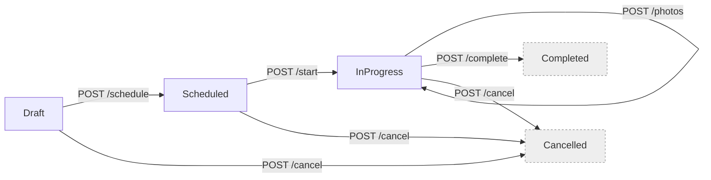

# 04 — API Contracts (REST v1)

> Scope: Public HTTP surface for the Jobs module. Base URL: `/api/v1/`.
> Content-Type: `application/json` (requests + responses). `application/problem+json` for errors.
> Auth: JWT Bearer on every endpoint (`Authorization: Bearer <token>`) unless noted.
> Multi-tenancy: `organizationId` is derived server-side from the `org` claim; never accepted from the client body/query.
> API version negotiation: URL segment (`/api/v1/...`). Future versions coexist via `/api/v2/...`.

---

## 1. Conventions

### 1.1 Error envelope — RFC 7807 ProblemDetails

Every non-2xx response uses this shape:

```json
{
  "type": "https://jobtracker.local/errors/job/invalid-transition",
  "title": "Invalid state transition",
  "status": 409,
  "detail": "Cannot transition from Completed to InProgress.",
  "instance": "/api/v1/jobs/6c9e6f3b-.../start",
  "code": "Job.InvalidTransition",
  "traceId": "00-4bf92f3577b34da6a3ce929d0e0e4736-00f067aa0ba902b7-01",
  "errors": {
    "status": [ "Value 'Zoomed' is not a valid JobStatus." ]
  }
}
```

- `type` — stable URI per error code (docs anchor).
- `code` — machine-readable stable code from `Error.Code` (e.g., `Job.CannotScheduleInPast`).
- `traceId` — W3C trace context; correlates to OTel spans.
- `errors` — present only on `400 Bad Request` (per-field failures from FluentValidation).

### 1.2 Error mapping (`ErrorType` → HTTP status)

| `ErrorType`  | HTTP | Notes |
|---|---|---|
| `Validation`   | 400 | Fluent validation or domain validation errors. |
| `Unauthorized` | 401 | Missing/invalid JWT. |
|                | 403 | Authenticated but wrong tenant / missing policy. |
| `NotFound`     | 404 | Aggregate not found within the tenant scope. |
| `Conflict`     | 409 | Invariant violation (invalid transition, duplicate, concurrency). |
|                | 412 | If we ever add `If-Match` / ETag preconditions. |
|                | 422 | Reserved for semantic (non-schema) validation if we want to distinguish from 400. |
| `Unexpected`   | 500 | Bug / unhandled. Redacted message; full detail in logs + trace. |

Optimistic concurrency (`DbUpdateConcurrencyException`) is mapped to **409** with `code = "Job.ConcurrencyConflict"` and a suggested `Retry-After: 0` header.

### 1.3 Pagination

All list endpoints use **cursor pagination**. Query params:

| Param | Type | Notes |
|---|---|---|
| `pageSize` | int (1..100) | default 20 |
| `cursor`   | string (base64 opaque) | `null` on first page |

Response body:
```json
{
  "items": [ /* ... */ ],
  "nextCursor": "MjAyNS0wOC0wOFQyMDoxOToxMi44MFo..."   // null when no more
}
```

Clients pass `nextCursor` verbatim as `?cursor=` on the next request. The cursor is not decodable to a page number; it is a stable ordering anchor.

### 1.4 Idempotency (writes)

`POST /jobs` supports an optional header **`Idempotency-Key: <uuid>`**. The API deduplicates on `(tenantId, path, idempotencyKey)` for 24h; a duplicate returns the original 2xx response and body without re-executing the command. Implemented via a lightweight `idempotency_keys` table in the `jobs` schema (not shown in the domain DDL; it's an infrastructure concern).

Verbs other than `POST` are naturally idempotent (`PUT`/`DELETE`) or state-guarded (transition endpoints return 409 on repeat).

### 1.5 Rate limiting

Sliding-window: **100 requests/min per `sub` claim** for read endpoints, **30 req/min** for write endpoints. Exceeded → `429 Too Many Requests` with `Retry-After` and a `RateLimit-*` header set (draft-06 spec).

### 1.6 Common headers

| Header | Direction | Purpose |
|---|---|---|
| `Authorization: Bearer ...` | request | JWT with `sub`, `org`, `roles`. |
| `Idempotency-Key: <uuid>`   | request | Optional, dedupe writes. |
| `X-Correlation-Id: <uuid>`  | request/response | Echoed back and enriched into logs. |
| `traceparent` (W3C) | request/response | OTel context propagation. |
| `ETag` / `If-Match` | future | Not enforced in this iteration. |

---

## 2. Endpoints — summary table

| # | Verb | Route | Purpose | Auth policy |
|---|---|---|---|---|
| 1 | `GET`    | `/api/v1/jobs`                       | Search / paginate jobs | `jobs:read` |
| 2 | `GET`    | `/api/v1/jobs/{id}`                  | Get job by id (with photos) | `jobs:read` |
| 3 | `POST`   | `/api/v1/jobs`                       | Create a Draft job | `jobs:write` |
| 4 | `POST`   | `/api/v1/jobs/{id}/schedule`         | Transition Draft → Scheduled | `jobs:write` |
| 5 | `POST`   | `/api/v1/jobs/{id}/start`            | Transition Scheduled → InProgress | `jobs:write` |
| 6 | `POST`   | `/api/v1/jobs/{id}/photos`           | Add a photo to a non-terminal job | `jobs:write` |
| 7 | `POST`   | `/api/v1/jobs/{id}/complete`         | Transition InProgress → Completed | `jobs:write` |
| 8 | `POST`   | `/api/v1/jobs/{id}/cancel`           | Transition to Cancelled | `jobs:write` |

There is **no** `PUT`/`PATCH /jobs/{id}` and **no** `DELETE`. Mutations happen through explicit transition verbs (task-based UI + audit-friendly).

---

## 3. Endpoint details

### 3.1 `GET /api/v1/jobs` — search / list

**Query parameters** (all optional except pagination defaults):

| Name | Type | Notes |
|---|---|---|
| `q`         | string (≤200) | Websearch FTS on title + description. |
| `statuses`  | comma-sep enum | Any of `Draft,Scheduled,InProgress,Completed,Cancelled`. Repeatable: `?statuses=Scheduled,InProgress`. |
| `from`      | ISO 8601 datetime | Inclusive lower bound on `scheduledDate`. |
| `to`        | ISO 8601 datetime | Inclusive upper bound on `scheduledDate`. |
| `pageSize`  | int (1..100) | default 20 |
| `cursor`    | string | opaque, from previous response |

**200 OK — response body:**

```json
{
  "items": [
    {
      "id": "6c9e6f3b-2c4c-4f2b-b6dc-64f2a2d8a1a1",
      "title": "Roof repair — 341 Oak Ave",
      "description": "Emergency leak.",
      "status": "InProgress",
      "scheduledDate": "2026-08-20T09:00:00Z",
      "startedAt": "2026-08-20T09:12:03Z",
      "completedAt": null,
      "assigneeId": "2f5a6f8f-...-...",
      "customerId": "b1e7...-...",
      "photoCount": 4,
      "createdAt": "2026-08-19T18:03:22Z",
      "updatedAt": "2026-08-20T09:12:03Z"
    }
  ],
  "nextCursor": "MjAyNi0wOC0xOVQxODowMzoyMi4wMFp8NmM5ZTZmM2ItMmM0Yy00ZjJiLWI2ZGMtNjRmMmEyZDhhMWEx"
}
```

**Failures:**
- `400` — invalid `pageSize`, `from > to`, unknown status, malformed `cursor`. Errors under `errors.<field>`.
- `401` / `403` — auth.
- `429` — rate limit.

---

### 3.2 `GET /api/v1/jobs/{id}` — get by id (with photos)

Path: `id` = uuid.

**200 OK:**

```json
{
  "id": "6c9e6f3b-2c4c-4f2b-b6dc-64f2a2d8a1a1",
  "title": "Roof repair — 341 Oak Ave",
  "description": "Emergency leak.",
  "status": "InProgress",
  "address": {
    "street": "341 Oak Ave",
    "city": "Cleveland",
    "state": "OH",
    "zipCode": "44113",
    "latitude": 41.4993,
    "longitude": -81.6944
  },
  "scheduledDate": "2026-08-20T09:00:00Z",
  "startedAt": "2026-08-20T09:12:03Z",
  "completedAt": null,
  "cancelledAt": null,
  "cancellationReason": null,
  "signatureUrl": null,
  "assigneeId": "2f5a6f8f-...-...",
  "customerId": "b1e7...-...",
  "photos": [
    {
      "id": "9a...",
      "url": "https://cdn.jobtracker.local/photos/9a.jpg",
      "capturedAt": "2026-08-20T09:33:10Z",
      "caption": "Water damage under skylight"
    }
  ],
  "createdAt": "2026-08-19T18:03:22Z",
  "updatedAt": "2026-08-20T09:33:10Z",
  "version": 12
}
```

`version` is returned so future PATCH/If-Match support can piggyback on optimistic concurrency.

**Failures:**
- `404` — `Job.NotFound` (either doesn't exist or belongs to another tenant — same code, do not leak existence).

---

### 3.3 `POST /api/v1/jobs` — create Draft

**Request:**

```json
{
  "title": "Roof repair — 341 Oak Ave",
  "description": "Emergency leak.",
  "address": {
    "street": "341 Oak Ave",
    "city": "Cleveland",
    "state": "OH",
    "zipCode": "44113",
    "latitude": 41.4993,
    "longitude": -81.6944
  },
  "customerId": "b1e7fabc-6d92-4f8a-9d1e-1b2c4d5e6f70"
}
```

**Constraints (validator):**
- `title`: 1..200, required.
- `description`: 0..4000.
- `address.street/city/state`: required, length limits per DDL.
- `address.zipCode`: matches `^\d{5}(-\d{4})?$`.
- `address.latitude`: -90..90 (nullable).
- `address.longitude`: -180..180 (nullable).
- `customerId`: non-empty uuid.

**Optional headers:** `Idempotency-Key`.

**201 Created:**
```
Location: /api/v1/jobs/6c9e6f3b-2c4c-4f2b-b6dc-64f2a2d8a1a1
```
Body:
```json
{ "id": "6c9e6f3b-2c4c-4f2b-b6dc-64f2a2d8a1a1" }
```

**Failures:**
- `400` — validator errors: e.g., `errors.title = [ "Required" ]`.
- `409` — `Job.CannotScheduleInPast` (never on Create; on Schedule).
- `422` — reserved.

---

### 3.4 `POST /api/v1/jobs/{id}/schedule` — Draft → Scheduled

**Request:**
```json
{
  "scheduledDate": "2026-08-25T14:00:00Z",
  "assigneeId":    "2f5a6f8f-4d2e-4b0d-9d7a-11e2b8c1a2a0"
}
```

**Constraints:**
- `scheduledDate` must be strictly greater than `now()` (server time).
- `assigneeId` non-empty uuid.

**200 OK:** empty body (or the updated job resource; we return empty for state-transition endpoints to keep them thin).

**Failures:**
- `404` — not found.
- `409` — `Job.InvalidTransition` when current status is not `Draft`.
- `409` — `Job.CannotScheduleInPast`.
- `409` — `Job.ConcurrencyConflict` (optimistic concurrency).

---

### 3.5 `POST /api/v1/jobs/{id}/start` — Scheduled → InProgress

**Request:** empty body.

**200 OK:** empty body.

**Failures:**
- `404` — not found.
- `409` — `Job.InvalidTransition` unless status was `Scheduled`.

---

### 3.6 `POST /api/v1/jobs/{id}/photos` — add a photo

**Request:**
```json
{
  "url": "https://cdn.jobtracker.local/photos/9a.jpg",
  "capturedAt": "2026-08-20T09:33:10Z",
  "caption": "Water damage under skylight"
}
```

**Constraints:**
- `url` non-empty absolute URI, ≤1000 chars.
- `capturedAt` required ISO 8601.
- `caption` ≤500 chars, optional.
- Status must not be `Completed` or `Cancelled`.

**Note about uploads:** in this iteration the photo file itself is uploaded by the client to object storage (e.g., S3-compatible) via a **pre-signed URL** obtained from a separate endpoint (out of scope for the assessment); the `url` in this call points at the resulting object. Direct multipart-to-API upload is not supported to keep the API layer stateless.

**201 Created:**
```
Location: /api/v1/jobs/{jobId}
```
Body:
```json
{ "id": "9a0f...-..." }
```

**Failures:**
- `404` — job not found.
- `409` — `Job.CannotAddPhotoToTerminalJob`.
- `400` — invalid url / caption too long.

---

### 3.7 `POST /api/v1/jobs/{id}/complete` — InProgress → Completed

**Request:**
```json
{
  "signatureUrl": "https://cdn.jobtracker.local/signatures/sig-6c9e.png"
}
```

**Constraints:**
- `signatureUrl` non-empty absolute URI, ≤1000 chars.

**200 OK:** empty body.

**Side effects:** raises `JobCompletedDomainEvent` inside the transaction. The outbox interceptor enqueues `JobCompletedIntegrationEvent` in the same transaction. Downstream (async, at-least-once):
- Billing generates an invoice.
- Notifications sends an email to the customer.

**Failures:**
- `404` — not found.
- `409` — `Job.InvalidTransition` unless status was `InProgress`.
- `400` — missing/invalid `signatureUrl`.
- `409` — `Job.ConcurrencyConflict`.

---

### 3.8 `POST /api/v1/jobs/{id}/cancel` — → Cancelled

**Request:**
```json
{ "reason": "Customer rescheduled indefinitely." }
```

**Constraints:**
- `reason` 1..500.
- Status must be `Draft`, `Scheduled`, or `InProgress`.

**200 OK:** empty body.

**Failures:**
- `404` — not found.
- `409` — `Job.InvalidTransition` (already terminal).
- `400` — reason too long / empty.

---

## 4. DTO type reference (canonical shapes)

```csharp
// Requests
public sealed record CreateJobRequest(
    string Title, string Description, AddressRequest Address, Guid CustomerId);

public sealed record AddressRequest(
    string Street, string City, string State, string ZipCode,
    decimal? Latitude, decimal? Longitude);

public sealed record ScheduleJobRequest(DateTimeOffset ScheduledDate, Guid AssigneeId);
public sealed record CompleteJobRequest(string SignatureUrl);
public sealed record CancelJobRequest(string Reason);
public sealed record AddJobPhotoRequest(string Url, DateTimeOffset CapturedAt, string? Caption);

// Responses
public sealed record JobListItemResponse(
    Guid Id, string Title, string Description, JobStatus Status,
    DateTimeOffset? ScheduledDate, DateTimeOffset? StartedAt, DateTimeOffset? CompletedAt,
    Guid? AssigneeId, Guid CustomerId, int PhotoCount,
    DateTimeOffset CreatedAt, DateTimeOffset UpdatedAt);

public sealed record JobResponse(
    Guid Id, string Title, string Description, JobStatus Status,
    AddressResponse Address,
    DateTimeOffset? ScheduledDate, DateTimeOffset? StartedAt, DateTimeOffset? CompletedAt,
    DateTimeOffset? CancelledAt, string? CancellationReason, string? SignatureUrl,
    Guid? AssigneeId, Guid CustomerId,
    IReadOnlyList<JobPhotoResponse> Photos,
    DateTimeOffset CreatedAt, DateTimeOffset UpdatedAt, uint Version);

public sealed record AddressResponse(
    string Street, string City, string State, string ZipCode,
    decimal? Latitude, decimal? Longitude);

public sealed record JobPhotoResponse(
    Guid Id, string Url, DateTimeOffset CapturedAt, string? Caption);

public sealed record PagedResponse<T>(IReadOnlyList<T> Items, string? NextCursor);
```

Response contract lives in `Jobs.Presentation` (or a dedicated `Jobs.Api.Contracts` project shared between Presentation and a future OpenAPI-generated client). Domain types (`Job`, `Address`, `JobPhoto`) are **never** serialized directly.

---

## 5. Status transitions — API view



All state-changing endpoints are POSTs (idempotent by state guard: repeating them on a terminal state returns 409, not 200). This keeps semantics clear vs REST orthodoxy where PUT would imply full-resource replacement, which we explicitly don't want.

---

## 6. Auth model (headline)

Token claims consumed by the API:

| Claim | Purpose |
|---|---|
| `sub`    | UserId. Populates `ICurrentUserContext`. |
| `org`    | OrganizationId. Populates `ITenantContext`. Server rejects if missing. |
| `roles`  | Coarse-grained (Admin, Dispatcher, Crew). Used for policy mapping. |
| `perms`  | Fine-grained (`jobs:read`, `jobs:write`). |
| `iss`, `aud`, `exp` | Standard JWT validation. |

Policy examples (in `Program.cs`):

```csharp
builder.Services.AddAuthorizationBuilder()
    .AddPolicy("jobs:read",  p => p.RequireClaim("perms", "jobs:read"))
    .AddPolicy("jobs:write", p => p.RequireClaim("perms", "jobs:write"));
```

---

## 7. Versioning strategy

- **URL segment** (`/api/v1/...`) is the primary channel.
- Additive changes within v1 are allowed (new optional fields, new endpoints). Breaking changes require v2.
- Deprecated endpoints/fields return a `Deprecation` header (RFC 8594) + `Link: rel="successor-version"`.
- Client SDK regeneration is triggered by OpenAPI schema changes in CI.

---

## 8. Concrete error catalog (Jobs)

| Code | Type | HTTP | Meaning |
|---|---|---|---|
| `Job.NotFound` | NotFound | 404 | Job id doesn't exist in current tenant scope. |
| `Job.InvalidTitle` | Validation | 400 | Title empty or > 200 chars. |
| `Job.DescriptionTooLong` | Validation | 400 | > 4000 chars. |
| `Job.InvalidTransition` | Conflict | 409 | Illegal state transition attempted. |
| `Job.CannotScheduleInPast` | Conflict | 409 | `scheduledDate <= now()`. |
| `Job.SignatureRequired` | Validation | 400 | Missing signature on Complete. |
| `Job.InvalidSignatureUrl` | Validation | 400 | signatureUrl not an absolute uri. |
| `Job.InvalidCancellationReason` | Validation | 400 | Empty / > 500 chars. |
| `Job.InvalidPhotoUrl` | Validation | 400 | Not absolute. |
| `Job.CaptionTooLong` | Validation | 400 | > 500 chars. |
| `Job.CannotAddPhotoToTerminalJob` | Conflict | 409 | Status Completed / Cancelled. |
| `Job.ConcurrencyConflict` | Conflict | 409 | Optimistic concurrency violation. |
| `Auth.MissingTenant` | Unauthorized | 401 | JWT lacks `org` claim. |
| `Auth.Forbidden` | Unauthorized | 403 | Policy check failed. |

---

## 9. Example: full lifecycle round-trip

### 9.1 Create

```
POST /api/v1/jobs
Authorization: Bearer <token>
Idempotency-Key: 8b1e5f3a-2f22-4c3d-9d0f-b0f7f3a3e91d
Content-Type: application/json

{
  "title": "Roof inspection",
  "description": "Annual",
  "address": { "street": "1 Main", "city": "Akron", "state": "OH", "zipCode": "44301" },
  "customerId": "b1e7fabc-6d92-4f8a-9d1e-1b2c4d5e6f70"
}
```

Response:
```
HTTP/1.1 201 Created
Location: /api/v1/jobs/6c9e6f3b-2c4c-4f2b-b6dc-64f2a2d8a1a1
Content-Type: application/json

{ "id": "6c9e6f3b-2c4c-4f2b-b6dc-64f2a2d8a1a1" }
```

### 9.2 Schedule

```
POST /api/v1/jobs/6c9e6f3b-.../schedule
{ "scheduledDate": "2026-08-25T14:00:00Z", "assigneeId": "2f5a6f8f-..." }
```
`200 OK` (empty body).

### 9.3 Start

`POST /api/v1/jobs/6c9e6f3b-.../start` → `200 OK`.

### 9.4 Add photo

`POST /api/v1/jobs/6c9e6f3b-.../photos` with the JSON body from §3.6 → `201 Created` with the new photo id.

### 9.5 Complete

`POST /api/v1/jobs/6c9e6f3b-.../complete` with `signatureUrl` → `200 OK`. Async: an invoice is created, an email is sent (see 06).

### 9.6 Attempt an invalid transition

`POST /api/v1/jobs/6c9e6f3b-.../start` on an already-Completed job:
```
HTTP/1.1 409 Conflict
Content-Type: application/problem+json

{
  "type": "https://jobtracker.local/errors/job/invalid-transition",
  "title": "Invalid state transition",
  "status": 409,
  "detail": "Cannot transition from Completed to InProgress.",
  "code": "Job.InvalidTransition",
  "traceId": "..."
}
```

---

## 10. Swagger / OpenAPI generation

- `Swashbuckle.AspNetCore` generates OpenAPI 3.0 from controllers + `[ProducesResponseType]` + XML comments.
- Enum values are emitted as strings (`options.SwaggerGenOptions.MapType<JobStatus>(...)`).
- ProblemDetails responses documented globally via a document filter that adds default error responses (`400`, `401`, `403`, `404`, `409`, `429`, `500`) to every operation.
- The generated `swagger.json` is exported by CI to be consumed by the frontend's OpenAPI codegen (`openapi-typescript` or `orval`) to build a typed API client (see 05-frontend-architecture.md).

---

## 11. Backward-compat / evolution guardrails

- Response shapes carry **stable field names**; enums are strings, not ordinals.
- Optional fields default to explicit `null`, never omitted, so TypeScript clients don't need `| undefined` union handling.
- Removing or renaming a field is a **breaking change** and requires a new version.
- Adding a new field is non-breaking; clients must ignore unknown fields.
- Cursors are opaque; the API can change the internal ordering key without a version bump as long as the semantics ("stable next-page anchor") hold.

---

## 12. Related documents

- 01 — Domain model (aggregate methods that back these endpoints).
- 02 — Database design (query behind `GET /jobs`).
- 03 — Backend solution structure (controllers + pipeline behaviors).
- 06 — Async messaging (what happens after Complete).
- 07 — Testing (E2E flows + contract tests).
