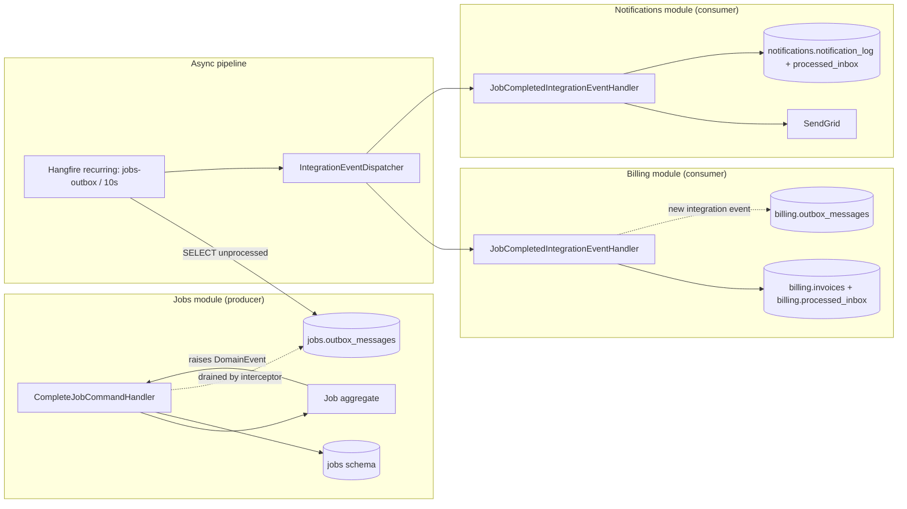

# 06 — Async Messaging (Outbox + Hangfire + Idempotency + DLQ)

> Goal: reliable, at-least-once, cross-module event delivery on a single Postgres, without an external broker.
> Consumers must be **idempotent**. Producers must be **atomic** with the business transaction. Poison events go to a **DLQ**.

---

## 1. Motivation and constraints

### 1.1 Why not just call another module in-process?

Anti-pattern: inside `CompleteJobCommandHandler`, directly call `IInvoiceService.Generate(...)` and `INotificationService.NotifyCustomer(...)`.

Problems:
1. **Coupling** — Jobs now knows about Billing and Notifications. Deployment coupling, test coupling, transaction coupling.
2. **Atomicity conflict** — If invoice generation fails, do we fail the Job completion? Users hate that. If we swallow the error, we've lost the side-effect silently.
3. **Time coupling** — The API call cannot return until side-effects are done. p95 jumps.
4. **Retry semantics** — Retrying "the whole command" also retries the business write. Dangerous.

### 1.2 Why domain events + integration events + outbox

- **Domain events** (in-proc, inside the same tx as the business operation) let the aggregate express *what happened* without knowing *who cares*.
- **Integration events** (cross-module contracts) decouple modules through a stable wire format.
- **Outbox** persists the "we owe the world these events" record in the same DB transaction as the business change → **no lost events**.
- A background worker (**Hangfire**) reads the outbox, dispatches, marks processed. Consumers get **at-least-once** delivery and are responsible for idempotency.

### 1.3 What we're not building (out of scope)

- No external broker (RabbitMQ / Kafka / Azure Service Bus). The outbox + Hangfire combo is enough for MVP scale and keeps the deployable single.
- No sagas / process managers. Long-running workflows would require a dedicated coordinator; not needed here.
- No exactly-once. We embrace **at-least-once + idempotent consumers**. Exactly-once is a myth in distributed systems.

---

## 2. Architecture recap



---

## 3. Producer side — atomic outbox

### 3.1 Domain event → outbox row translation

Two options were considered:

| Option | Pros | Cons | Chosen |
|---|---|---|---|
| **A. Directly persist `DomainEvent` as `OutboxMessage`.** The domain event *is* the wire payload. | Simplest. | Leaks internal domain types across modules (breaks the "IntegrationEvents is the public contract" rule). |  |
| **B. Have an `INotificationHandler<DomainEvent>` in Application that maps to an `IIntegrationEvent` and calls `IOutboxWriter.EnqueueAsync(...)` synchronously (same tx).** | Domain events stay internal. Integration events are explicit, versioned records under `Jobs.IntegrationEvents`. | Slightly more code per event. | **Yes** |

### 3.2 `IOutboxWriter`

```csharp
// BuildingBlocks.Application
public interface IIntegrationEvent
{
    Guid EventId { get; }
    DateTimeOffset OccurredOn { get; }
}

public interface IOutboxWriter
{
    Task EnqueueAsync<T>(T @event, CancellationToken ct) where T : IIntegrationEvent;
}
```

Implementation (Jobs.Infrastructure):

```csharp
internal sealed class OutboxWriter(JobsDbContext db, ITenantContext tenant) : IOutboxWriter
{
    public Task EnqueueAsync<T>(T @event, CancellationToken ct) where T : IIntegrationEvent
    {
        var msg = new OutboxMessage
        {
            EventId = @event.EventId,
            Type = typeof(T).AssemblyQualifiedName!,
            Content = JsonSerializer.Serialize(@event, JsonPolicy.Default),
            OccurredOn = @event.OccurredOn,
            OrganizationId = tenant.OrganizationId.Value,
        };
        db.OutboxMessages.Add(msg);
        // No SaveChanges here — the UnitOfWorkBehavior commits everything atomically.
        return Task.CompletedTask;
    }
}
```

Because the writer uses the **same `DbContext`** as the aggregate write, both rows end up in the same tx. If the tx rolls back, both disappear.

### 3.3 The domain-event-to-integration-event handler

```csharp
// Jobs.Application/Jobs/EventHandlers/JobCompletedDomainEventHandler.cs
internal sealed class JobCompletedDomainEventHandler(IOutboxWriter outbox)
    : INotificationHandler<JobCompletedDomainEvent>
{
    public Task Handle(JobCompletedDomainEvent e, CancellationToken ct) =>
        outbox.EnqueueAsync(new JobCompletedIntegrationEvent(
            EventId: e.Id,
            JobId: e.JobId.Value,
            OrganizationId: e.OrganizationId.Value,
            CustomerId: e.CustomerId.Value,
            AssigneeId: e.AssigneeId.Value,
            StartedAt: e.StartedAt,
            CompletedAt: e.CompletedAt,
            SignatureUrl: e.SignatureUrl,
            OccurredOn: e.OccurredOn), ct);
}
```

**Crucial invariant:** `EventId` on the integration event equals the domain event's `Id`. This is the stable idempotency key that flows all the way to consumers.

### 3.4 `InsertOutboxMessagesInterceptor` — dispatch to handlers pre-save

Domain events are collected by aggregates via `RaiseDomainEvent(...)`. Someone has to dispatch them to `INotificationHandler<T>` *inside* the same transaction so that the handlers' `IOutboxWriter.EnqueueAsync` writes actually land in the tx.

Two dispatch strategies:

| Strategy | Description |
|---|---|
| **A. Interceptor calls MediatR.Publish for each domain event before SaveChanges.** Handlers write outbox rows to the same DbContext. Then SaveChanges commits everything. | Chosen. |
| **B. Interceptor serializes domain events directly into `outbox_messages` (skipping application handlers).** Simpler; but the domain event = the wire event, coupling internal to external. Rejected (see 3.1). |

Implementation:

```csharp
public sealed class InsertOutboxMessagesInterceptor(IPublisher publisher) : SaveChangesInterceptor
{
    public override async ValueTask<InterceptionResult<int>> SavingChangesAsync(
        DbContextEventData ed, InterceptionResult<int> result, CancellationToken ct = default)
    {
        var ctx = ed.Context!;
        var pending = ctx.ChangeTracker
            .Entries<IAggregateRoot>()
            .SelectMany(e => e.Entity.DrainEvents())
            .ToList();

        foreach (var domainEvent in pending)
        {
            await publisher.Publish(domainEvent, ct);   // runs *DomainEventHandler → OutboxWriter → db.Add
        }

        return await base.SavingChangesAsync(ed, result, ct);
    }
}
```

`IPublisher` (MediatR) invokes every registered `INotificationHandler<T>` synchronously. Any exception here rolls back the tx — desired behavior.

**Ordering:**
1. Application handler calls `job.Complete(...)`.
2. Aggregate raises `JobCompletedDomainEvent` into its internal list.
3. Handler calls `repo.AddAsync(...)` / EF tracks the state change.
4. `UnitOfWorkBehavior` calls `db.SaveChangesAsync()`.
5. `InsertOutboxMessagesInterceptor.SavingChangesAsync` runs first → drains events, `Publish`es them → domain event handlers enqueue outbox rows via `IOutboxWriter`.
6. `base.SavingChangesAsync` finally emits the SQL — Postgres commits **all** rows (`jobs` + `outbox_messages`) atomically.

If step 5 throws, step 6 never runs → tx rolled back → no zombie outbox rows.

---

## 4. Consumer side — Hangfire processor

### 4.1 The polling loop

```csharp
// BuildingBlocks.Infrastructure/Outbox/OutboxProcessor.cs
public abstract class OutboxProcessor<TDbContext>
    where TDbContext : DbContext
{
    private readonly TDbContext _db;
    private readonly IIntegrationEventDispatcher _dispatcher;
    private readonly ILogger _log;
    private readonly OutboxOptions _opt;

    protected OutboxProcessor(TDbContext db, IIntegrationEventDispatcher d, ILogger l, IOptions<OutboxOptions> o)
    { _db = db; _dispatcher = d; _log = l; _opt = o.Value; }

    // Hangfire calls this on a schedule.
    public async Task ProcessAsync(CancellationToken ct)
    {
        var schemaTable = _opt.OutboxSchemaTable;         // e.g., "jobs.outbox_messages"
        var batch = await _db.Database
            .SqlQueryRaw<OutboxRow>(
                $"SELECT id, event_id, type, content, occurred_on, attempts " +
                $"FROM {schemaTable} " +
                $"WHERE processed_on IS NULL AND attempts < @maxAttempts " +
                $"ORDER BY id " +
                $"LIMIT @batch " +
                $"FOR UPDATE SKIP LOCKED",
                new NpgsqlParameter("maxAttempts", _opt.MaxAttempts),
                new NpgsqlParameter("batch", _opt.BatchSize))
            .ToListAsync(ct);

        foreach (var row in batch)
        {
            var stopwatch = Stopwatch.StartNew();
            try
            {
                var type = Type.GetType(row.Type, throwOnError: true)!;
                var @event = (IIntegrationEvent)JsonSerializer.Deserialize(row.Content, type, JsonPolicy.Default)!;
                await _dispatcher.DispatchAsync(@event, ct);

                await _db.Database.ExecuteSqlRawAsync(
                    $"UPDATE {schemaTable} SET processed_on = now(), attempts = attempts + 1 WHERE id = @id",
                    new NpgsqlParameter("id", row.Id));

                _log.LogInformation("Dispatched outbox {EventId} ({Type}) in {Ms}ms",
                    row.EventId, row.Type, stopwatch.ElapsedMilliseconds);
            }
            catch (Exception ex)
            {
                _log.LogWarning(ex, "Outbox dispatch failed for {EventId} ({Type})", row.EventId, row.Type);
                await _db.Database.ExecuteSqlRawAsync(
                    $"UPDATE {schemaTable} SET attempts = attempts + 1, last_error = @err WHERE id = @id",
                    new NpgsqlParameter("err", ex.ToString()),
                    new NpgsqlParameter("id", row.Id));
                // Do NOT rethrow — keep processing the rest of the batch.
            }
        }
    }
}
```

Key points:
- **`FOR UPDATE SKIP LOCKED`** lets multiple workers scale horizontally without stepping on each other. Each row is claimed by exactly one worker for the duration of dispatch.
- **Partial index** `ix_outbox_unprocessed` makes the `SELECT` a tiny scan even when the table is huge.
- **Batch size** trades throughput vs latency (default 100).
- **Per-message try/catch** ensures a poison message never poisons the whole batch.

### 4.2 One processor per module

Each module gets its own concrete processor + its own recurring job id, keyed on its own schema:

```csharp
// Jobs.Infrastructure
internal sealed class JobsOutboxProcessor(JobsDbContext db, IIntegrationEventDispatcher d,
    ILogger<JobsOutboxProcessor> l, IOptions<OutboxOptions> o)
    : OutboxProcessor<JobsDbContext>(db, d, l, o) { }
```

Registration in the API composition root:

```csharp
RecurringJob.AddOrUpdate<JobsOutboxProcessor>(
    "jobs-outbox", p => p.ProcessAsync(CancellationToken.None), "*/10 * * * * *");
RecurringJob.AddOrUpdate<BillingOutboxProcessor>(
    "billing-outbox", p => p.ProcessAsync(CancellationToken.None), "*/10 * * * * *");
```

Two separate outbox tables (`jobs.outbox_messages`, `billing.outbox_messages`) preserve **module data ownership**: each module owns its outgoing traffic in its own schema.

### 4.3 Dispatcher — in-proc MediatR wrapper

```csharp
public interface IIntegrationEventDispatcher
{
    Task DispatchAsync(IIntegrationEvent @event, CancellationToken ct);
}

internal sealed class MediatrIntegrationEventDispatcher(IServiceProvider sp) : IIntegrationEventDispatcher
{
    public async Task DispatchAsync(IIntegrationEvent @event, CancellationToken ct)
    {
        using var scope = sp.CreateScope();
        var publisher = scope.ServiceProvider.GetRequiredService<IPublisher>();
        await publisher.Publish((INotification)@event, ct);  // integration events also implement INotification
    }
}
```

Each event dispatch runs in its **own DI scope** — fresh DbContext, fresh `ITenantContext` (populated from the event's `OrganizationId`), no bleed between events.

**Multi-tenant scoping in workers:**

```csharp
internal sealed class OutboxTenantContext(IIntegrationEvent current) : ITenantContext
{
    public OrganizationId OrganizationId { get; } = new(current.OrganizationId);
}
```

Registered as scoped, hydrated per-event by the dispatcher.

---

## 5. Consumer idempotency

Every subscriber MUST be idempotent. The mechanism is a **processed_inbox** table per consumer module.

### 5.1 The pattern

```csharp
// Billing.Application/EventHandlers/JobCompletedIntegrationEventHandler.cs
internal sealed class JobCompletedIntegrationEventHandler(
    BillingDbContext db,
    IInvoiceCalculator calc,
    IDateTimeProvider clock,
    ITenantContext tenant,
    IOutboxWriter outbox)
    : INotificationHandler<JobCompletedIntegrationEvent>
{
    public async Task Handle(JobCompletedIntegrationEvent e, CancellationToken ct)
    {
        const string handler = nameof(JobCompletedIntegrationEventHandler);

        // 1) Reserve the idempotency slot. Unique index → duplicate insert throws → we swallow and return.
        try
        {
            db.ProcessedInbox.Add(new ProcessedInboxRow(e.EventId, handler, clock.UtcNow));
            await db.SaveChangesAsync(ct);
        }
        catch (DbUpdateException ex) when (IsUniqueViolation(ex))
        {
            // Already processed — safe skip.
            return;
        }

        // 2) Do the work.
        var amount = calc.ComputeAmount(e);
        var invoice = Invoice.Create(new OrganizationId(e.OrganizationId), new JobId(e.JobId), amount, clock.UtcNow);
        db.Invoices.Add(invoice);

        // 3) Enqueue our own integration event (in the same tx via billing.outbox_messages).
        await outbox.EnqueueAsync(new InvoiceGeneratedIntegrationEvent(
            EventId: Guid.NewGuid(),
            InvoiceId: invoice.Id.Value,
            JobId: e.JobId,
            OrganizationId: e.OrganizationId,
            Amount: amount.Value,
            GeneratedAt: clock.UtcNow,
            OccurredOn: clock.UtcNow), ct);

        // 4) Commit: invoice row + inbox row + outbox row atomic.
        await db.SaveChangesAsync(ct);
    }

    private static bool IsUniqueViolation(DbUpdateException ex) =>
        ex.InnerException is PostgresException pg && pg.SqlState == "23505";
}
```

**Why this pattern is bullet-proof:**
- Step 1 SaveChanges creates the inbox row **or fails on unique constraint**. Both branches leave the DB in a consistent state.
- Step 4 SaveChanges commits everything (invoice + outbox + already-committed inbox row) — but wait, step 1 already committed. Isn't there a window where step 1 committed and step 4 fails?
  - Yes. If step 4 fails, we've marked "processed" but nothing was actually done. On the next poll the outbox row is still unprocessed, but the inbox will reject it.
  - Fix (adopted): wrap steps 1–4 in a **single transaction**. Step 1 becomes an `INSERT ... ON CONFLICT DO NOTHING` + read the `xmax` to know whether we inserted. If rows == 0 → already processed → commit an empty tx and return. Otherwise proceed.

**Refined step 1:**
```sql
INSERT INTO billing.processed_inbox (event_id, handler, processed_on)
VALUES (@eventId, @handler, now())
ON CONFLICT (event_id, handler) DO NOTHING
RETURNING event_id;
```

If `RETURNING` yields zero rows → skip.

The whole handler runs inside the caller's transaction (created by the dispatcher's scope). Postgres serializes concurrent workers on the unique index → exactly one processes an event even under retries.

### 5.2 Notifications consumer (SendGrid)

Same pattern, but the side-effect is external. If SendGrid fails after we've inserted the inbox row, we've lost a notification (we won't retry). To fix:

Option A: **outbox-then-side-effect.** Store a "notification pending" row inside the tx (inbox), commit. A separate worker picks up pending rows and calls SendGrid. If SendGrid fails, the worker retries with exponential backoff. If it exhausts retries, mark as `Failed` and move to DLQ.

Option B: **side-effect inside the tx** (what we sketched above). Simpler, but SendGrid failures require compensating logic.

Adopted: **Option A.** External I/O happens in a second, dedicated worker with its own retry policy.

```csharp
public async Task Handle(JobCompletedIntegrationEvent e, CancellationToken ct)
{
    // Reserve idempotency + persist "pending" log row atomically.
    db.NotificationLog.Add(new NotificationLog(
        Id: Guid.NewGuid(),
        OrganizationId: new(e.OrganizationId),
        Recipient: await ResolveEmailAsync(e.CustomerId, ct),
        Channel: "Email",
        Template: "JobCompleted",
        Status: "Pending"));

    db.ProcessedInbox.Add(new ProcessedInboxRow(e.EventId, nameof(this), clock.UtcNow));

    try { await db.SaveChangesAsync(ct); }
    catch (DbUpdateException ex) when (IsUniqueViolation(ex)) { return; }

    // Actual send happens in NotificationDispatcher (recurring Hangfire job).
}
```

---

## 6. Dead Letter Queue (DLQ)

### 6.1 Design

An outbox row that reaches `attempts >= MaxAttempts` (default 8) is considered **poisoned**. It is moved to a companion table `outbox_messages_dead` and hidden from the polling worker.

```sql
CREATE TABLE jobs.outbox_messages_dead (
    LIKE jobs.outbox_messages INCLUDING ALL,
    dead_lettered_on timestamptz NOT NULL DEFAULT now(),
    first_error text,
    last_error text
);
```

A recurring job runs every minute:

```csharp
public sealed class DeadLetterMover(JobsDbContext db, IOptions<OutboxOptions> o, ILogger<DeadLetterMover> log)
{
    public async Task MoveAsync(CancellationToken ct)
    {
        var moved = await db.Database.ExecuteSqlInterpolatedAsync($@"
            WITH d AS (
                DELETE FROM jobs.outbox_messages
                 WHERE attempts >= {o.Value.MaxAttempts}
                   AND processed_on IS NULL
                 RETURNING *
            )
            INSERT INTO jobs.outbox_messages_dead
                (id, event_id, type, content, occurred_on, processed_on, attempts, last_error, organization_id, first_error)
            SELECT id, event_id, type, content, occurred_on, processed_on, attempts, last_error, organization_id, last_error
              FROM d;", ct);

        if (moved > 0) log.LogWarning("Moved {N} outbox messages to DLQ.", moved);
    }
}
```

### 6.2 Alerting

- A Prometheus/OTel counter `outbox_dead_lettered_total{module="jobs"}` is incremented per move.
- An alert fires if the counter increases → on-call investigates.

### 6.3 Replay tooling

A minimal admin endpoint (or CLI) allows replaying a DLQ row after the bug is fixed:

```
POST /admin/outbox/dlq/{id}/replay
```

The endpoint moves the row back to the live outbox table with `attempts = 0` and clears the error columns. Behind an admin policy + audit log.

---

## 7. Ordering, deduplication, and delivery guarantees

| Property | Guarantee |
|---|---|
| **Producer-side atomicity** | Business rows + outbox rows commit or roll back together. Zero-loss on producer. |
| **Delivery** | At-least-once. A row is processed until acknowledged; retries occur automatically. |
| **Ordering** | Per-aggregate ordering is preserved (events for the same `JobId` appear in the outbox in `id` order and are processed in that order because `SELECT ... ORDER BY id`; a single worker picks up all of them and dispatches them serially — cross-tenant/cross-aggregate ordering is NOT guaranteed if we run multiple workers). This is acceptable for our domain. |
| **Deduplication** | Consumer-side, via `processed_inbox` unique key `(event_id, handler)`. Same event replayed → skipped. |
| **Poison isolation** | After `MaxAttempts` failures, event is moved to DLQ; the pipeline keeps flowing. |

### 7.1 What could still go wrong?

| Scenario | Mitigation |
|---|---|
| Handler crashes after external side-effect but before writing to processed_inbox | Wrap in tx OR make the external side-effect itself idempotent (SendGrid `X-Message-Id` header). |
| Two workers process the same row | `FOR UPDATE SKIP LOCKED` prevents it. |
| Consumer bug causes cascading DLQ moves | Alert fires; DLQ retention allows replay after fix. |
| `Type.GetType(...)` fails after a rename | Contracts live in `*.IntegrationEvents` and are versioned; never rename a shipped record. If you must, keep the old type name and add a v2 event side-by-side. |
| Clock skew between web tier and DB | All timestamps are DB-generated (`now()`) for outbox rows; app-generated timestamps in event payload live in event content, not filtering. |

---

## 8. Configuration

`OutboxOptions`:

```csharp
public sealed class OutboxOptions
{
    public int PollIntervalSeconds { get; set; } = 10;
    public int BatchSize { get; set; } = 100;
    public int MaxAttempts { get; set; } = 8;
    public string OutboxSchemaTable { get; set; } = "jobs.outbox_messages";  // set per module in DI
}
```

`appsettings.json`:
```json
{
  "Outbox": {
    "PollIntervalSeconds": 10,
    "BatchSize": 100,
    "MaxAttempts": 8
  }
}
```

Overridable per environment. Production values will be tuned once we have real load metrics.

---

## 9. Observability

Every outbox operation emits:
- **Log lines** with `traceId`, `EventId`, `EventType`, `attempts`, elapsed ms.
- **OTel span** (`outbox.dispatch`) per event, child of the recurring Hangfire span.
- **Metrics** (via `System.Diagnostics.Metrics`):
  - `outbox.enqueued_total{module}` — counter, incremented by `IOutboxWriter`.
  - `outbox.dispatched_total{module,handler}` — counter, per successful dispatch.
  - `outbox.failed_total{module,handler}` — counter, per handler failure.
  - `outbox.dead_lettered_total{module}` — counter.
  - `outbox.lag_seconds{module}` — histogram, `now() - occurred_on` at dispatch time.

Dashboards must alert on:
- p95 lag > 60 s.
- Failure rate > 1% over 5 min.
- Any DLQ activity.

---

## 10. Where each piece lives (recap)

| Concern | Project |
|---|---|
| `IOutboxWriter` interface | `BuildingBlocks.Application` |
| `OutboxWriter` implementation (uses module DbContext) | `Jobs.Infrastructure`, `Billing.Infrastructure` |
| `InsertOutboxMessagesInterceptor` (generic) | `BuildingBlocks.Infrastructure` |
| `OutboxProcessor<TDbContext>` abstract base | `BuildingBlocks.Infrastructure` |
| Concrete `JobsOutboxProcessor` / `BillingOutboxProcessor` | Each module's Infrastructure |
| `IIntegrationEventDispatcher` | `BuildingBlocks.Infrastructure` |
| `IntegrationEvent` records | `<Module>.IntegrationEvents` |
| Domain-event → integration-event handlers | `<Module>.Application/EventHandlers` |
| `ProcessedInboxRow` entity | `<ConsumerModule>.Infrastructure` |
| `DeadLetterMover` | `BuildingBlocks.Infrastructure` |

---

## 11. Migration path to a real broker (optional, future)

If we later need cross-service scaling, priority queues, or subscribers outside the monolith:

1. Introduce a **broker adapter** (RabbitMQ / Azure Service Bus). The producer side stays the same — the `OutboxProcessor` becomes a **relay**: it reads unprocessed rows, publishes them to the broker, marks processed. Consumers move out of the monolith.
2. The `IIntegrationEvent` contracts remain unchanged — they were designed as serializable, versioned records precisely for this.
3. Consumer-side idempotency stays exactly the same (`processed_inbox`).
4. Only new addition: broker-native retry/DLQ replaces the SQL-based DLQ, but we can keep both for defense-in-depth during the migration.

The current design is thus a **stepping stone** to an event-driven system, not a dead-end.

---

## 12. Related documents

- 00 — Architecture overview (async pipeline sequence diagrams).
- 01 — Domain model (JobCompletedDomainEvent).
- 02 — DB design (outbox_messages, processed_inbox schemas).
- 03 — Backend solution (interceptor + processor project locations).
- ADR-0002 — Outbox + Hangfire (no external broker).
- ADR-0007 — Domain event → integration event mapping (option B chosen over option A).
